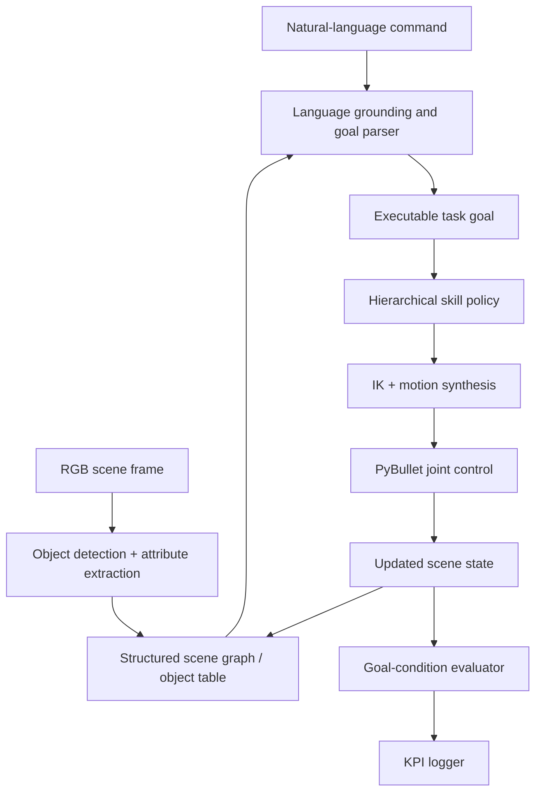

# Simulation-First Vision-Language-Action Manipulation for Natural Language Object Rearrangement

## AX Hackathon Problem Statement 1 Hybrid Blueprint and Execution Report

**Author:** Ryan  
**Project Type:** Phase 1 Blueprint + Phase 2 Execution Master Document  
**Primary Target:** AX Hackathon Problem Statement 1  
**System Mode:** Simulation-first, hardware-transferable  

---

## Table of Contents

1. [Abstract](#1-abstract)
2. [Introduction and Motivation](#2-introduction-and-motivation)
3. [Hackathon Problem Alignment](#3-hackathon-problem-alignment)
4. [Problem Statement](#4-problem-statement)
5. [Design Principles](#5-design-principles)
6. [Related Work and Design Positioning](#6-related-work-and-design-positioning)
7. [System Overview](#7-system-overview)
8. [Simulation Environment Architecture](#8-simulation-environment-architecture)
9. [Physical Arm Extension Path](#9-physical-arm-extension-path)
10. [Perception Pipeline](#10-perception-pipeline)
11. [Language Grounding and Command Interpretation](#11-language-grounding-and-command-interpretation)
12. [Hierarchical VLA and Planning Pipeline](#12-hierarchical-vla-and-planning-pipeline)
13. [Action Execution and Safety](#13-action-execution-and-safety)
14. [Datasets, Models, and Training Strategy](#14-datasets-models-and-training-strategy)
15. [Evaluation and Benchmarking](#15-evaluation-and-benchmarking)
16. [Demo Plan](#16-demo-plan)
17. [Open-Source and Compliance Plan](#17-open-source-and-compliance-plan)
18. [Risks, Limitations, and Mitigations](#18-risks-limitations-and-mitigations)
19. [Implementation Roadmap](#19-implementation-roadmap)
20. [Expected Deliverables](#20-expected-deliverables)
21. [Why This Can Win](#21-why-this-can-win)
22. [Conclusion](#22-conclusion)
23. [References](#23-references)

---

## 1. Abstract

This document defines a simulation-first Vision-Language-Action (VLA) robotic system for **natural-language object manipulation**, designed specifically for **AX Hackathon Problem Statement 1** and intentionally structured to remain deployable on a real low-cost robotic arm after simulation validation. The system aims to interpret commands such as "pick the red block and place it in the right tray," "stack the blue block on the yellow block," and "move the green cylinder to the left of the red cube," then execute those commands through a unified pipeline that combines scene perception, language grounding, skill-based planning, action generation, and goal-condition verification.

The proposed system is centered on a **simulation-first architecture** implemented in **PyBullet**, with optional ROS2 compatibility for later modular integration. A four-degree-of-freedom robotic manipulator is modeled in URDF and evaluated in cluttered tabletop scenes containing blocks, cylinders, trays, and distractor objects. The system uses RGB scene observations, structured scene state extraction, language-conditioned task parsing, and a hierarchical manipulation policy built around discrete manipulation skills: `REACH`, `GRASP`, `LIFT`, and `PLACE`. These skills are combined with inverse kinematics, workspace safety filters, and a final-state verifier that measures whether the executed scene satisfies the commanded objective.

Unlike a generic hackathon submission that only demonstrates isolated pick-and-place behavior, this blueprint explicitly targets the core capabilities implied by the problem statement: **natural-language command interpretation**, **multi-object manipulation**, **relational grounding**, **simulation-based demonstration**, and **bounded generalization across unseen scene layouts and paraphrased commands**. The evaluation plan therefore includes five named KPI families: Task Success Rate (TSR), Goal Condition Accuracy (GCA), Command Interpretation Accuracy (CIA), Task Completion Rate (TCR), and Error Analysis Coverage. These metrics are defined separately rather than blended into a single success score so that failure sources can be attributed to perception, grounding, planning, or execution.

The project also preserves a major differentiator from the underlying real-world robotics effort: a **sim-to-real transfer path** to an affordable four-DOF STS3215 serial-bus servo arm with a Raspberry Pi 5 inference stack and Teensy 4.1 real-time controller. This real-hardware extension is not treated as a hackathon dependency; instead, it is positioned as a high-value continuation path that strengthens the credibility, practical relevance, and future extensibility of the submission.

If executed successfully, this system would demonstrate that a compact, open-source, simulation-first VLA pipeline can achieve meaningful natural-language manipulation performance without requiring expensive industrial hardware, proprietary APIs, or massive data infrastructure. The intended outcome is a hackathon submission that is both **judge-aligned** and **engineering-serious**: strong enough to compete in the short term and structured enough to guide real implementation afterward.

---

## 2. Introduction and Motivation

### 2.1 Why This Problem Matters

Natural-language robotic manipulation is one of the clearest demonstrations of embodied intelligence because it requires the system to connect three different competencies:

1. **Perception** — understand what objects exist, where they are, and how they relate spatially.
2. **Language understanding** — convert a human instruction into a grounded, machine-usable goal.
3. **Action execution** — plan and execute motor actions that transform the world into the desired goal state.

Traditional robotics pipelines solve these pieces independently, often with brittle hand-written logic and heavy task-specific engineering. Vision-Language-Action models instead promise a more unified approach: map scene context and language commands into manipulation behavior while retaining some degree of generalization. In practice, however, many VLA demonstrations depend on expensive hardware, large datasets, and compute resources that do not translate well to low-cost development environments or hackathon timelines.

### 2.2 Why a Simulation-First Strategy Is the Right Fit

For a hackathon setting, simulation-first development offers several practical advantages:

- It enables rapid iteration without hardware integration bottlenecks.
- It provides a clean benchmark environment for measuring success rates across many trials.
- It allows repeatable demonstrations of 5+ commands under controlled conditions.
- It reduces risk by separating algorithmic capability from hardware-debug uncertainty.

A simulation-first architecture is not a compromise in this project. It is the correct primary substrate for the hackathon deliverable. The physical robotic arm extension is still valuable, but it should be layered on top of a strong simulation benchmark rather than being the first dependency.

### 2.3 Why Sim-to-Real Still Matters

Although the hackathon deliverable should prioritize simulation, a project that can transfer beyond simulation has greater technical depth and practical relevance. The broader robotics effort behind this document already includes:

- a low-cost 4-DOF manipulator built from STS3215 serial-bus servos,
- Raspberry Pi 5 inference,
- Teensy 4.1 real-time control,
- wrist-mounted depth sensing,
- end-effector contact sensing,
- and an interpretable hierarchical action pipeline.

That broader foundation makes this document stronger. The submission is not just a toy simulation demo; it is a simulation-centered embodiment of a system that has a credible path to physical deployment.

### 2.4 Core Position of This Document

This report is intentionally dual-purpose:

- **As a hackathon blueprint**, it presents a simulation-first VLA manipulation system aligned to Problem Statement 1.
- **As an execution master document**, it defines architecture, metrics, module boundaries, risks, and roadmap details that can directly guide implementation.

This means the document must be both persuasive and operational. It should convince judges that the concept is well designed while also being specific enough that an engineer could build from it without guessing the system boundaries.

---

## 3. Hackathon Problem Alignment

### 3.1 Direct Alignment to Problem Statement 1

Problem Statement 1 asks for a Vision-Language-Action robotic system capable of understanding and executing object manipulation tasks from natural-language commands. The target capabilities visible from the brief include:

- understanding commands involving object identity, attributes, and actions,
- handling multiple objects in the scene,
- supporting structured evaluation,
- demonstrating performance in simulation,
- and showing some degree of robustness or generalization.

This project is designed to align to those requirements directly rather than indirectly.

### 3.2 Deliverables Mapping

| Hackathon Deliverable | Proposed Project Output | Alignment |
|---|---|---|
| Functional Python/PyTorch repository | Full simulation pipeline with training, inference, evaluation, and demo scripts | Strong |
| Demo video with 5+ natural-language commands in simulation | PyBullet demo video with multiple command families and on-screen overlays | Strong |
| Final report | This report plus final implementation results update | Strong |
| Vision + language + action stack using open tools | YOLOv8, PyTorch, Transformers, PyBullet, optional ROS2 bridge | Strong |
| Quantitative evaluation | Explicit KPI suite with trial counts and ablations | Strong |

### 3.3 Capability Mapping

| Capability Expected by Problem Statement | Proposed System Response |
|---|---|
| Natural-language command interpretation | Dedicated grounding module parses object, action, destination, and relations |
| Multi-object manipulation | Cluttered scenes with distractors, trays, stack targets, and reference objects |
| Relational reasoning | Support for `left of`, `right of`, `on top of`, `next to`, and tray-based placement |
| Generalization | Evaluate on unseen layouts, object permutations, and command paraphrases |
| Robust action execution | Hierarchical skill policy, IK, safety constraints, and goal verifier |

### 3.4 KPI Mapping

| KPI | Target | Why It Matters |
|---|---|---|
| Task Success Rate (TSR) | 80-85% | Measures end-to-end episode success |
| Goal Condition Accuracy (GCA) | 90% | Checks whether final state satisfies the instruction |
| Command Interpretation Accuracy (CIA) | 85% | Isolates language grounding quality from motor execution |
| Task Completion Rate (TCR) | 80% | Measures whether the full task lifecycle was completed without abort |
| Error Analysis Coverage | 100% | Every failure assigned a labeled cause category |

### 3.5 Why This Alignment Matters

Many technically impressive robotics projects fail in competitions because they are architecturally interesting but poorly matched to the evaluation format. This document is built to avoid that mismatch. The project is therefore framed around:

- simulation as the primary validation environment,
- explicit multi-command evaluation,
- named KPIs,
- visible compliance with open-source expectations,
- and a final demo narrative that judges can understand quickly.

---

## 4. Problem Statement

### 4.1 Formal Task Definition

Given:

- a tabletop scene containing multiple objects,
- one natural-language instruction,
- and an articulated robotic manipulator operating in simulation,

the system must output a sequence of actions that transforms the scene into one that satisfies the commanded goal while respecting kinematic and workspace constraints.

### 4.2 Command Families Supported

The system is designed to support the following command families:

1. **Attribute-conditioned pick and place**
   - "Pick the red block and place it in the left tray."
2. **Object-type selection**
   - "Pick the cylinder and place it in the center tray."
3. **Stacking**
   - "Stack the blue block on the yellow block."
4. **Relational rearrangement**
   - "Move the green cube to the right of the red cylinder."
5. **Distractor disambiguation**
   - "Pick the small red block, not the large red block."

### 4.3 Scope Boundaries

The system does not attempt to solve open-world robotics. Its scope is intentionally bounded:

- tabletop manipulation only,
- one active arm,
- a fixed set of known object categories in the primary benchmark,
- grasping and rearrangement rather than tool use,
- and bounded generalization rather than unrestricted zero-shot open-vocabulary manipulation.

This bounded framing is deliberate. A hackathon-winning system must be broad enough to feel intelligent but narrow enough to execute reliably.

### 4.4 Success Criterion

An episode is considered successful only when:

1. the correct target object has been selected,
2. the commanded transformation has been performed,
3. the final state satisfies the goal-condition evaluator,
4. the action was completed within the step/time budget,
5. and the execution remained within workspace and safety constraints.

This definition prevents inflated success claims where a robot appears active but does not truly satisfy the instruction.

---

## 5. Design Principles

The system is built around seven design principles.

### 5.1 Simulation-First, Hardware-Transferable

The first complete version must work in PyBullet before any physical-arm dependency becomes blocking. Hardware transfer is a strategic extension, not a prerequisite.

### 5.2 Explicit Language Grounding

Commands should be grounded into structured goals rather than treated as raw strings all the way through execution. This makes evaluation, debugging, and relation handling much clearer.

### 5.3 Hierarchical Over Flat End-to-End Control

A skill-structured manipulation pipeline is more interpretable, more debuggable, and more realistic for a low-DOF system than a completely flat policy that directly regresses joint actions from raw input.

### 5.4 Measurable Goals Over Vague Demos

Every demo-visible capability should map to a benchmarked metric. This means:

- no hidden manual resets,
- no ambiguous success claims,
- no unmeasured "it kind of worked" outputs.

### 5.5 Low-Cost Open-Source Tooling

The stack should rely on openly available libraries, models, and datasets so that the submission is reproducible and aligned with practical deployment constraints.

### 5.6 Controlled Ambition

The project should be ambitious in system integration, not reckless in problem scope. That means focusing on a coherent task family and executing it cleanly.

### 5.7 Sim-to-Real Credibility

Even if final judging happens on simulation artifacts, the design should preserve the interfaces needed for future real-arm deployment. This adds depth, not distraction.

---

## 6. Related Work and Design Positioning

### 6.1 Large-Scale VLA Systems

Systems such as **RT-1**, **RT-2**, **OpenVLA**, and **Octo** demonstrate the power of pretrained visual-language representations for robotic action generation. These systems motivate the idea that a single model family can connect perception and control. However, most of them assume either large data regimes, expensive hardware, or high-DOF research manipulators.

### 6.2 Compact and Open VLA Models

**Octo-small** and **SmolVLA** are particularly relevant because they are closer to the practical constraints of smaller labs and lightweight deployment. This project does not commit blindly to any single model. Instead, it treats model selection as a design decision constrained by:

- inference cost,
- training accessibility,
- grounding quality,
- and compatibility with simulation-driven data collection.

### 6.3 Manipulation Baselines for Grounding

**CLIPort** and related language-conditioned manipulation systems demonstrate that strong task performance can emerge from explicit scene representations paired with language-conditioned action selection. This project borrows that insight at the level of design philosophy: rather than rely on one opaque action generator, it preserves intermediate structure in the scene and goal.

### 6.4 What This System Does Differently

This project occupies a specific niche:

1. it is **simulation-first for hackathon delivery**,
2. it is **explicitly benchmarked against named manipulation KPIs**,
3. it supports **relational commands and goal-condition verification**,
4. it retains a **hierarchical manipulation policy** instead of a purely flat controller,
5. and it preserves a **credible path to low-cost physical deployment**.

### 6.5 Strategic Positioning

This is not intended to be the largest or most general VLA system. It is intended to be:

- more reproducible than giant proprietary systems,
- more grounded than a pure LLM wrapper around robot actions,
- more realistic than a toy scripted demo,
- and more buildable than an overambitious open-world manipulation claim.

---

## 7. System Overview

The system receives an RGB observation and a natural-language instruction, constructs a scene representation, grounds the instruction into a target goal, generates a structured manipulation plan, executes that plan through a skill-based policy and IK controller, and finally verifies whether the resulting scene satisfies the goal.

### 7.1 End-to-End Data Flow



### 7.2 Main Runtime Layers

The system is organized into six functional layers:

1. **Perception layer**
   - Detect objects and recover scene state from RGB frames.
2. **Grounding layer**
   - Map language instructions to target objects, relations, and destination constraints.
3. **Planning layer**
   - Convert grounded goals into skill-level execution structure.
4. **Control layer**
   - Use IK and safe motion generation to produce executable actions in simulation.
5. **Verification layer**
   - Evaluate whether the final state matches the instruction.
6. **Benchmark layer**
   - Log metrics, categorize failures, and support reproducible evaluation.

### 7.3 Primary Differentiator

The most important architectural choice is that the pipeline is **goal-grounded and verifiable**, not merely language-conditioned. The system does not only attempt an action; it attempts to reach a measurable scene condition.

### 7.4 Proposed Software Module Layout

To keep the system implementation clean and extensible, the repository should separate simulation, perception, grounding, control, and evaluation:

```text
ax_vla_ps1/
├── sim/
│   ├── env.py                 # PyBullet environment wrapper
│   ├── urdf/                  # Arm and object models
│   ├── scene_builder.py       # Randomized scene initialization
│   └── task_reset.py          # Benchmark episode reset utilities
├── ros2_bridge/               # Optional ROS2 wrappers for later integration
│   ├── node.py                # Optional action server / topic bridge
│   └── adapters.py            # PyBullet <-> ROS2 message adapters
├── perception/
│   ├── detector.py            # YOLO wrapper
│   ├── attributes.py          # Color/type/size extraction
│   └── scene_graph.py         # Object table + relation computation
├── language/
│   ├── parser.py              # Template parser or learned classifier
│   ├── grounding.py           # Command -> structured goal
│   └── prompt_sets.py         # Evaluation instruction templates/paraphrases
├── planning/
│   ├── skill_machine.py       # REACH/GRASP/LIFT/PLACE controller
│   ├── ik.py                  # Inverse kinematics
│   ├── target_pose.py         # Goal pose and relation target synthesis
│   └── safety.py              # Joint/workspace constraints
├── policy/
│   ├── skill_model.py         # Optional learned skill prediction
│   ├── action_model.py        # Optional VLA policy head
│   └── dataset.py             # Episode loading and batching
├── evaluation/
│   ├── metrics.py             # TSR/GCA/CIA/TCR computation
│   ├── verifier.py            # Final-state goal evaluation
│   ├── ablations.py           # Variant benchmark runner
│   └── error_analysis.py      # Failure taxonomy aggregation
├── demo/
│   ├── run_demo.py            # Video-ready execution runner
│   └── overlays.py            # On-screen annotations
└── scripts/
    ├── train_detector.py
    ├── train_policy.py
    ├── benchmark.py
    └── export_results.py
```

This module structure preserves clear interfaces and makes it easier to substitute learned components later without rewriting the full stack.

---

## 8. Simulation Environment Architecture

### 8.1 Primary Simulation Stack

The reference simulation environment is built in **PyBullet** because it offers:

- rapid prototyping,
- strong Python integration,
- deterministic resets,
- controllable camera views,
- simple rigid-body scene construction,
- and fast benchmarking across many episodes.

ROS2 support is planned as a compatibility extension rather than the primary simulation dependency.

### 8.2 Simulated Robot Model

The simulated robot is a URDF representation of a low-cost 4-DOF tabletop manipulator. The arm is modeled with:

- base yaw,
- shoulder pitch,
- elbow pitch,
- gripper open-close actuation.

The initial version uses stable top-down pick and place with a fixed approach orientation. This keeps the workspace behavior simple enough for reliable evaluation while still supporting nontrivial command grounding.

### 8.3 Scene Layout

Each episode consists of:

- one arm,
- a tabletop plane,
- 3 to 6 objects,
- 1 to 3 destination trays or goal zones,
- optional stack targets,
- distractor objects with overlapping colors or shapes.

Objects are drawn from a compact benchmark set such as:

- cubes,
- blocks,
- cylinders,
- trays,
- reference objects for relational tasks.

### 8.4 Randomization Policy

To avoid overfitting to one camera angle or one object arrangement, the simulator randomizes:

- object positions,
- small orientation variations,
- clutter density,
- color layouts,
- lighting or texture variants where feasible,
- camera noise or small viewpoint perturbations.

This randomization is not intended to create full sim-to-real realism. Its purpose is to improve robustness across evaluation episodes and avoid brittle single-scene optimization.

### 8.5 Episode Lifecycle

Each simulation episode follows this sequence:

1. Reset scene with seeded object placement.
2. Render observation frame.
3. Issue one natural-language command.
4. Ground the command into a goal specification.
5. Run the skill/control loop until success, failure, or timeout.
6. Evaluate final state against the goal condition.
7. Log metrics and failure category.

### 8.6 Scene State Representation

Internally, each scene is represented as a structured object table:

```python
scene_objects = [
    {
        "id": "obj_1",
        "class": "cube",
        "color": "red",
        "size": "small",
        "position_xyz": [0.14, -0.08, 0.03],
        "bbox_xyxy": [122, 171, 168, 218],
        "extent_xyz": [0.03, 0.03, 0.03],
        "is_targetable": True
    },
    ...
]
```

This representation is used by both the language grounding module and the goal-condition evaluator.

### 8.7 Why PyBullet Is Enough for the Hackathon

The project does not require photorealistic simulation to satisfy the problem statement. What matters most is:

- repeatable object manipulation,
- measurable goal completion,
- natural-language grounding,
- multi-object disambiguation,
- and a visible end-to-end pipeline.

PyBullet is therefore a pragmatic and sufficient core environment.

### 8.8 Workspace and Object Assumptions

The default simulated workspace should remain intentionally simple:

- tabletop area approximately 60 cm x 60 cm,
- object spawn area centered inside the arm reach envelope,
- destination trays positioned at fixed but distinct regions,
- stackable rigid objects sized for top-down grasping,
- and camera framing that keeps the full workspace visible.

A practical initial benchmark object set is:

| Object Class | Count Range | Typical Attributes |
|---|---|---|
| Cube / block | 2-4 | color, size |
| Cylinder | 1-2 | color, size |
| Tray / bin | 1-3 | named destination region |
| Reference object | 1-2 | used in relational commands |

This bounded object family is enough to test multi-object grounding without introducing unnecessary manipulation complexity.

---

## 9. Physical Arm Extension Path

### 9.1 Role of the Physical Extension

The physical arm is not the primary validation substrate for this hackathon document. It is the continuation path that makes the system more valuable than a pure simulation exercise.

### 9.2 Shared Components Between Sim and Real

The following components are intentionally shared:

- natural-language command interface,
- goal representation,
- skill-level execution state machine,
- object-centric planning structure,
- IK layer,
- evaluation logic where possible,
- high-level module boundaries.

### 9.3 Components That Change Between Sim and Real

| Shared Logic | Simulation Version | Hardware Version |
|---|---|---|
| Scene observation | Sim camera render | Pi Camera 3 overhead feed |
| Object state | Direct sim scene + detector | Detector + calibration pipeline |
| Arm execution | PyBullet joint control | Teensy command packet |
| Contact handling | Sim grasp state / collision | IMU + servo load contact oracle |
| Depth | Sim known object state or derived observation | Wrist ToF + calibration |

### 9.4 Why This Strengthens the Proposal

By maintaining a clean interface between planning and actuation, the project can argue that the hackathon solution is not a dead-end demo. It is an implementation-ready benchmark system that can later be connected to the real affordable arm architecture already defined elsewhere in the project.

### 9.5 Key Hardware Differentiator Preserved

The physical extension remains technically distinct because it adds:

- low-cost embedded compute,
- contact sensing without force-torque sensors,
- serial-bus telemetry,
- and hardware safety clamping.

These are not needed for the hackathon benchmark, but they add genuine depth to the broader project story.

---

## 10. Perception Pipeline

### 10.1 Objective of the Perception Layer

The perception layer must provide a clean object-centric scene state to the grounding and planning modules. Its job is not just "find a box." It must produce enough structure to answer questions such as:

- which object is red,
- which object is a cylinder,
- which object is left of another object,
- which object is currently graspable,
- and where the destination region lies.

### 10.2 Object Detection Backbone

The default detector is **YOLOv8-nano** or **YOLOv8-small**, depending on available compute and latency budget. This choice is motivated by:

- fast training and iteration,
- simple PyTorch integration,
- strong performance for tabletop object detection,
- and practical inference latency.

The hackathon brief may reference other examples such as Detectron2 or OpenVLA-related tooling, but YOLOv8 is a stronger fit for this system's lightweight deployment and development speed.

### 10.3 Object Attribute Extraction

Beyond detection, each object instance is annotated with:

- class label,
- color label,
- size bucket or physical extent,
- approximate center position,
- instance confidence,
- and simulation-space position if available through the environment.

Color can be derived in one of two ways:

1. direct simulation metadata for training/evaluation truth,
2. image-space color extraction from the detected crop for perception realism.

### 10.4 Multi-Object Scene Handling

The system explicitly supports scenes with multiple objects of the same or different types. To support disambiguation, the scene representation tracks:

- color,
- type,
- relative position,
- size where relevant,
- tray/goal-zone identity,
- and whether an object is already stacked or placed.

### 10.5 Relative Spatial Feature Extraction

For relational commands, the perception module computes pairwise spatial relations:

```python
def relative_relation(
    a,
    b,
    directional_thresh=0.05,
    near_thresh=0.08,
    stack_xy_thresh=0.03,
    stack_z_thresh=0.025
):
    dx = a["position_xyz"][0] - b["position_xyz"][0]
    dy = a["position_xyz"][1] - b["position_xyz"][1]
    dz = a["position_xyz"][2] - b["position_xyz"][2]
    planar_dist = np.sqrt(dx**2 + dy**2)

    if dz > stack_z_thresh and planar_dist < stack_xy_thresh:
        return "on_top_of"
    if planar_dist < near_thresh:
        return "next_to"

    if dx > directional_thresh:
        return "right_of"
    if dx < -directional_thresh:
        return "left_of"
    if dy > directional_thresh:
        return "behind"
    if dy < -directional_thresh:
        return "in_front_of"
    return "near"
```

This relation layer allows commands involving one object relative to another to be grounded into concrete target placements.

The exact thresholds should be stored in configuration rather than hardcoded in production code. The values shown here are conservative initial defaults for a tabletop workspace of roughly 60 cm x 60 cm.

### 10.6 Why an Object-Centric Representation Is Important

A fully end-to-end action policy can be powerful, but it is difficult to debug and difficult to score cleanly. An object-centric perception layer helps:

- isolate language errors from perception errors,
- support goal verification,
- and make demos more interpretable.

---

## 11. Language Grounding and Command Interpretation

### 11.1 Purpose of the Grounding Layer

The language layer converts a natural-language instruction into a structured goal that can be executed and verified. This layer should answer four questions:

1. What is the **action type**?
2. What is the **target object**?
3. Is there a **reference object** or **destination**?
4. What final **scene relation** should hold after execution?

### 11.2 Structured Goal Schema

Each command is grounded into a schema such as:

```python
goal = {
    "action": "move",
    "target": {"class": "cube", "color": "green"},
    "reference": {"class": "cylinder", "color": "red"},
    "relation": "right_of",
    "destination": None,
    "exclusion": None
}
```

or:

```python
goal = {
    "action": "place",
    "target": {"class": "block", "color": "red"},
    "reference": None,
    "relation": None,
    "destination": {"type": "tray", "name": "left_tray"},
    "exclusion": None
}
```

or, for exclusion-based disambiguation:

```python
goal = {
    "action": "pick",
    "target": {"class": "block", "color": "red", "size": "small"},
    "reference": None,
    "relation": None,
    "destination": None,
    "exclusion": {"class": "block", "color": "red", "size": "large"}
}
```

### 11.3 Command Categories

The parser supports the following semantic patterns:

- `pick X`
- `pick X and place in Y`
- `move X to the left/right of Y`
- `stack X on top of Y`
- `place X in tray Y`
- `pick X, not Y`

### 11.4 Grounding Strategy

The grounding layer can be implemented with one of two strategies:

1. **Template-plus-parser baseline**
   - Fast, controllable, ideal for early reliability.
2. **Compact transformer encoder + classifier**
   - Better paraphrase handling, more scalable to command variation.

The recommended approach is to start with the template-plus-parser baseline for reliability, then optionally add a learned instruction encoder once the benchmark loop is stable.

### 11.5 Spatial Relation Support

The project explicitly supports relations such as:

- `left of`
- `right of`
- `on top of`
- `next to`
- `in front of`
- `behind`

These relations are grounded against the structured scene representation and converted into executable placement targets or geometric constraints.

### 11.6 Command Interpretation Accuracy

The grounding layer is measured independently through **Command Interpretation Accuracy (CIA)**. A command is counted as correctly interpreted only if:

- the correct target object is selected,
- the correct reference object or destination is selected,
- and the correct action/relation is inferred.

This metric prevents motor failures from masking language understanding quality.

For reproducible CIA evaluation, each benchmark command should have a gold structured-goal annotation stored alongside the episode seed. The parser output is then compared directly against that gold goal, while simulator metadata is used only to resolve whether the chosen goal refers to the correct object instance in the rendered scene.

### 11.7 Why This Matters for the Hackathon

The example commands in the problem statement imply that language is more than category lookup. A strong submission should show that it can interpret relational intent, not just color picking. This grounding layer is therefore a core hackathon-alignment feature, not an optional embellishment.

### 11.8 Example Command-to-Goal Conversions

| Natural-Language Command | Parsed Goal Summary |
|---|---|
| "Pick the red block and place it in the left tray." | target=`red block`, destination=`left tray`, action=`place` |
| "Stack the blue block on the yellow block." | target=`blue block`, reference=`yellow block`, relation=`on_top_of` |
| "Move the green cube to the right of the red cylinder." | target=`green cube`, reference=`red cylinder`, relation=`right_of` |
| "Pick the small red block, not the large red block." | target=`small red block`, exclusion=`large red block` |

Including this explicit mapping in the implementation helps ensure that both the parser and evaluator are aligned to the same semantics.

---

## 12. Hierarchical VLA and Planning Pipeline

### 12.1 Motivation for Hierarchy

A low-DOF manipulator benefits from explicit execution structure. Rather than predict arbitrary joint deltas at all times, the system breaks manipulation into four interpretable skill phases:

- `REACH`
- `GRASP`
- `LIFT`
- `PLACE`

These skills are not only intuitive for humans; they also provide cleaner logging, easier debugging, and more stable execution.

### 12.2 Skill Semantics

| Skill | Purpose | Typical Trigger to Enter | Exit Condition |
|---|---|---|---|
| REACH | Move above or toward target pose | Goal resolved and object localized | End-effector reaches pre-grasp region |
| GRASP | Close gripper around target object | REACH complete | Object grasped or contact confirmed |
| LIFT | Raise object to safe travel height | GRASP complete | Clearance height reached |
| PLACE | Move to destination and release | LIFT complete | Goal placement executed |

### 12.3 Planning Representation

The grounding layer outputs a symbolic goal. The planning layer turns that goal into:

- a target object pose,
- a destination pose or relation constraint,
- a skill sequence,
- and a controller-ready motion objective.

### 12.4 Policy Variants

The system supports multiple action-generation strategies:

1. **Rule-guided skill machine + IK baseline**
   - Most reliable for initial implementation.
2. **Learned skill classifier + action head**
   - Stronger VLA story and better alignment with the project theme.
3. **Compact VLA policy with skill-conditioned action decoding**
   - Best full system target if inference budget allows.

### 12.5 Recommended Execution Path

For the hackathon, the best staged strategy is:

1. establish the simulator and structured planner,
2. implement language grounding and goal verification,
3. run a rule-guided skill baseline,
4. then layer in a learned VLA component as the action or skill-prediction model.

This path maximizes the probability of delivering a robust end-to-end system within time constraints.

### 12.6 Why This Still Counts as a VLA System

The system remains a Vision-Language-Action system because:

- vision informs the scene representation,
- language specifies the task,
- action policy executes the manipulation,
- and learned components can condition on both vision and language.

The presence of skill structure does not weaken the VLA identity. It strengthens interpretability and feasibility.

### 12.7 Recommended Model Inputs and Outputs

For the learned-policy variant, the most useful compact interface is:

**Inputs**

- resized RGB observation,
- object-centric scene features,
- language embedding,
- structured goal embedding or goal token sequence,
- current skill state,
- current joint state,
- previous action or previous target pose.

**Outputs**

- next skill logits, or
- target pose delta, or
- joint-space action chunk.

A staged design is recommended:

1. learn **skill prediction** first,
2. then learn **action refinement** on top of a stable IK baseline.

This reduces the risk of trying to learn everything at once.

---

## 13. Action Execution and Safety

### 13.1 Control Strategy

The simulation controller operates at two levels:

1. a **task level** that defines the skill phase and motion target,
2. a **joint control level** that converts those targets into safe arm commands.

### 13.2 Motion Synthesis

Motion is generated through inverse kinematics and waypoint updates. The controller enforces:

- reachable workspace constraints,
- approach-height rules,
- grasp-height rules,
- destination stability conditions,
- and timeouts for stalled execution.

### 13.3 Safety Filters

Even in simulation, explicit safety logic is useful. It prevents pathological behavior and simplifies later hardware transfer.

The safety layer enforces:

- joint limit clamping,
- minimum table-clearance height,
- safe travel height during transport,
- no-release-until-destination logic,
- and max-step episode timeouts.

### 13.4 Goal-Condition Verification

The most important post-execution safety and correctness step is the final goal checker:

```python
def goal_condition_satisfied(goal, final_scene):
    target = resolve_target(goal["target"], final_scene)
    if target is None:
        return False

    if goal["destination"] is not None:
        return inside_destination_zone(target, goal["destination"], final_scene)

    relation = goal["relation"]
    if relation is None:
        return True

    ref = resolve_target(goal["reference"], final_scene)
    if ref is None:
        return False

    dx = target["position_xyz"][0] - ref["position_xyz"][0]
    dy = target["position_xyz"][1] - ref["position_xyz"][1]
    dz = target["position_xyz"][2] - ref["position_xyz"][2]
    planar_dist = np.sqrt(dx**2 + dy**2)

    if relation == "right_of":
        return dx > 0.05
    if relation == "left_of":
        return dx < -0.05
    if relation == "behind":
        return dy > 0.05
    if relation == "in_front_of":
        return dy < -0.05
    if relation == "next_to":
        return planar_dist < 0.08
    if relation == "on_top_of":
        return is_stably_stacked(target, ref, xy_thresh=0.03, z_thresh=0.025)

    return False
```

This explicit evaluator is what makes **Goal Condition Accuracy (GCA)** possible.

Two helper definitions are assumed by the verifier:

```python
def resolve_destination(destination, final_scene):
    return final_scene["goal_zones"].get(destination["name"])

def inside_destination_zone(target, destination, final_scene, radius=0.05):
    zone = resolve_destination(destination, final_scene)
    if zone is None:
        return False
    dx = target["position_xyz"][0] - zone["center_xyz"][0]
    dy = target["position_xyz"][1] - zone["center_xyz"][1]
    return np.sqrt(dx**2 + dy**2) <= radius

def is_stably_stacked(target, ref, xy_thresh=0.03, z_thresh=0.025):
    dx = target["position_xyz"][0] - ref["position_xyz"][0]
    dy = target["position_xyz"][1] - ref["position_xyz"][1]
    dz = target["position_xyz"][2] - ref["position_xyz"][2]
    return np.sqrt(dx**2 + dy**2) <= xy_thresh and dz >= z_thresh
```

For exclusion-based commands such as "pick the small red block, not the large red block," final goal verification should be paired with an episode log that records the chosen target instance ID. The verifier then confirms that the manipulated instance matched `goal["target"]` and did not match `goal["exclusion"]`.

### 13.5 Sim-to-Real Safety Extension

In hardware deployment, this same logical structure can be extended with:

- workspace clamps,
- servo safety limits,
- emergency stop handling,
- contact-based grasp confirmation,
- and depth-aware approach checks.

This keeps the architecture consistent across sim and real execution.

### 13.6 Runtime Control Loop in Simulation

The recommended simulation loop is:

```python
while not done:
    rgb = env.render_camera()
    scene = perception.update(rgb)
    goal = grounding.resolve(command, scene)
    skill = skill_machine.step(goal, scene, robot_state)
    target_pose = planner.compute(skill, goal, scene)
    safe_joint_cmd = safety.clamp(ik.solve(target_pose))
    env.step(safe_joint_cmd)
    done = verifier.check(goal, env.current_scene()) or env.timed_out()
```

This loop is intentionally simple. Complexity should be added to the learned components, not to the control orchestration.

---

## 14. Datasets, Models, and Training Strategy

### 14.1 Training Data Sources

The project can draw from four sources of supervision:

1. **Simulation-generated trajectories**
   - fastest and most scalable source for initial training.
2. **Hand-scripted expert policies**
   - useful for generating consistent baseline trajectories in simulation.
3. **Teleoperated or kinesthetic real demonstrations**
   - optional for sim-to-real refinement later.
4. **Public robot-learning priors**
   - model backbones or pretrained components where compatible.

Public resources suggested in the problem ecosystem such as **COCO**, **Open X-Embodiment**, **ALFRED**, **RoboNet**, **LIBERO**, and related manipulation or vision datasets are relevant as references or optional priors. The primary hackathon implementation, however, should remain centered on a compact simulation-generated benchmark so that the full stack stays controllable and reproducible within the project timeline.

### 14.2 Dataset Content

Each training episode should contain:

- command string,
- RGB observation sequence,
- object/state metadata,
- skill labels,
- action sequence,
- terminal success/failure label,
- and final goal-condition label.

### 14.3 Suggested Model Stack

| Component | Primary Choice | Fallback |
|---|---|---|
| Object detection | YOLOv8-nano / small | Ground-truth sim metadata during early prototyping |
| Language encoder | T5-small or lightweight transformer encoder | Rule-based parser |
| VLA backbone | SmolVLA or Octo-small if feasible | Skill-rule baseline |
| Goal grounding support | CLIP-style semantic matching for optional extension | explicit ontology mapping |

### 14.4 Why Not Force a Giant Model

A strong submission should optimize for reliability and clarity, not only model scale. A smaller, interpretable system that demonstrably solves the benchmark is more convincing than an oversized stack that cannot be validated under time constraints.

### 14.5 Skill Supervision

Skill labels can be generated automatically from scripted or simulator-known transitions:

- reaching until pre-grasp pose,
- grasp when object contact or closure condition is met,
- lift until travel height is reached,
- place until release and destination stability are satisfied.

This provides a path to training a skill classifier or skill-conditioned action head without manual frame-by-frame annotation.

### 14.6 Suggested Training Stages

1. Train or configure the object detector.
2. Validate language parser / grounding independently.
3. Build a scripted manipulation expert in simulation.
4. Convert expert rollouts into dataset episodes.
5. Train a skill predictor or action model on those trajectories.
6. Benchmark learned policy against scripted baseline.

**Recommended compute environment:** Google Colab A100, local RTX-class GPU, or comparable cloud GPU for learned-policy experiments. The rule-guided baseline and simulator benchmark can be developed CPU-first, but policy training should assume at least one modern GPU.

### 14.7 Target Data Scale

For the hackathon, a practical target is:

- 200 to 1000 simulated episodes across command families for baseline competence,
- plus optional curated real demonstrations later for transfer experiments.

The project should not overclaim massive data efficiency before empirical validation.

On a Colab A100 or comparable GPU, a compact detector fine-tune plus skill-model experiment on this data scale should typically remain within a few hours rather than days. Exact wall-clock time depends on image resolution, batch size, and whether only skill prediction or full action prediction is trained.

### 14.8 Suggested Loss Structure for Learned Variants

If a learned skill/action model is used, the training objective can combine:

- cross-entropy loss for skill prediction,
- L1 or smooth-L1 loss for target pose or joint deltas,
- binary success prediction loss for optional episode-quality estimation.

An example composite objective is:

```python
L_total = 1.0 * L_skill + 0.5 * L_action + 0.2 * L_success
```

The exact weighting should be tuned empirically, but this formulation keeps the skill signal dominant while still encouraging useful motion outputs.

### 14.9 Checkpoint Selection Policy

The best checkpoint should not be selected only on training loss. It should be selected using:

- validation Command Interpretation Accuracy,
- validation Task Success Rate on held-out scenes,
- and stability of behavior over repeated seeded trials.

This keeps model selection aligned with the actual benchmark objective.

---

## 15. Evaluation and Benchmarking

### 15.1 Evaluation Philosophy

The evaluation framework must distinguish:

- whether the system understood the instruction,
- whether it manipulated the right object,
- whether the final state satisfied the goal,
- and whether failures came from perception, grounding, planning, or execution.

This is essential for both competition credibility and engineering usefulness.

### 15.2 Core Benchmark Tasks

**Task 1 — Attribute-Based Pick and Place**  
Instruction examples: "Pick the red block and place it in the left tray."  
Purpose: baseline object selection + destination placement.

**Task 2 — Multi-Object Color Sorting**  
Instruction examples: "Place the blue cylinder in the center tray."  
Purpose: clutter handling + distractor disambiguation.

**Task 3 — Block Stacking**  
Instruction examples: "Stack the blue block on the yellow block."  
Purpose: sequential manipulation and stable end-state evaluation.

**Task 4 — Relational Rearrangement**  
Instruction examples: "Move the green cube to the right of the red cylinder."  
Purpose: relation grounding and precise final-state verification.

**Task 5 — Paraphrased Instruction Robustness**  
Instruction examples: "Put the red cube into the tray on the left."  
Purpose: bounded language generalization beyond one prompt template.

### 15.3 Definitive KPI Table

| Metric | Target | Measurement Method |
|---|---|---|
| Task Success Rate (TSR) | 80-85% | End-to-end success over full benchmark suite |
| Goal Condition Accuracy (GCA) | 90% | Final state matches parsed goal relation/destination |
| Command Interpretation Accuracy (CIA) | 85% | Grounding correctness before execution |
| Task Completion Rate (TCR) | 80% | Episodes completed without timeout or forced abort |
| Error Analysis Coverage | 100% | Every failure labeled into a cause taxonomy |

### 15.4 Additional Operational Metrics

| Metric | Target | Purpose |
|---|---|---|
| Mean episode time | <= 20 s | Keeps demos concise and repeatable |
| Collision-free transport rate | >= 95% | Indicates stable manipulation planning |
| Wrong-object grasp rate | <= 10% | Isolates target selection quality |
| Stable stack retention | >= 80% | Measures physical plausibility of stacked outputs |

### 15.5 Seen vs Unseen Evaluation Splits

The benchmark should include three splits:

1. **Seen layouts**
   - close to training distribution.
2. **Unseen arrangements**
   - same objects, new spatial configurations.
3. **Paraphrased commands**
   - alternate wording for familiar goal types.

This gives a bounded but meaningful generalization story.

### 15.6 Failure Taxonomy

Every failed episode must be assigned a root cause from the following categories:

- detection failure,
- attribute misclassification,
- command parsing failure,
- wrong target grounding,
- bad relation grounding,
- IK / motion failure,
- grasp failure,
- unstable placement,
- timeout,
- or verifier mismatch.

This directly supports the Error Analysis Coverage KPI.

### 15.7 Ablation Studies

Recommended ablations:

1. **No relational grounding**
   - Replace relation handling with tray-only tasks.
2. **No hierarchical skills**
   - Use a flatter action-selection strategy.
3. **No scene graph**
   - Attempt direct language-to-action without explicit structured object state.
4. **No randomization**
   - Evaluate brittleness under fixed-layout overfitting.
5. **No goal verifier**
   - Show why end-state checks matter for honest evaluation.

### 15.8 Important Integrity Note

All metrics in this blueprint are **target metrics**, not completed empirical results. The final submission must replace projections with measured values.

### 15.9 Suggested Trial Budget

To make final numbers credible, the benchmark should target at least:

- 30-50 trials per core task family,
- a balanced mix of seen and unseen layouts,
- and a fixed random seed list for reproducibility.

A practical total evaluation budget is 200-300 episodes.

### 15.10 Metric Definitions

For reporting consistency:

- **TSR** = successful end-to-end episodes / total episodes
- **GCA** = episodes with satisfied final goal condition / total episodes
- **CIA** = correctly grounded commands / total commands
- **TCR** = episodes completed without timeout or abort / total episodes

In the typical benchmark, **TSR will usually be less than or equal to GCA**, because TSR includes additional end-to-end requirements beyond final goal satisfaction. If a future implementation defines TSR differently, that relationship should be documented explicitly in the final report.

---

## 16. Demo Plan

### 16.1 Purpose of the Demo Video

The video should prove three things quickly:

1. the system understands different natural-language commands,
2. it can manipulate multiple objects in simulation,
3. and it is measured rather than staged informally.

### 16.2 Minimum Demo Command Set

The demo should include at least these five commands:

1. "Pick the red block and place it in the left tray."
2. "Pick the blue cylinder and place it in the center tray."
3. "Stack the green block on the yellow block."
4. "Move the red cube to the right of the blue cylinder."
5. "Pick the small red block, not the large red block."

### 16.3 Recommended Expanded Demo Set

To look stronger than the minimum, add:

6. "Place the green cylinder next to the yellow cube."
7. "Move the blue block in front of the red block."
8. "Put the cube on the right tray."

### 16.4 On-Screen Overlays

The best demo video should overlay:

- live command text,
- highlighted target object,
- parsed structured goal,
- current skill state,
- final success/failure verdict,
- and optional metric summaries.

### 16.5 Demo Sequence Design

The recommended ordering is:

1. simple pick-and-place,
2. distractor disambiguation,
3. stacking,
4. relational placement,
5. paraphrased command.

This creates a clear narrative of growing difficulty.

---

## 17. Open-Source and Compliance Plan

### 17.1 Open Toolchain Commitment

The project is designed to use only open-source or openly accessible tooling for core implementation:

- PyBullet
- PyTorch
- Ultralytics YOLO
- Hugging Face Transformers
- optional ROS2
- NumPy / SciPy / OpenCV

### 17.2 Model Selection Policy

Where learned components are used, preference is given to:

- open-weight models,
- reproducible training scripts,
- small-to-medium compute feasibility,
- and models that can be run locally without proprietary inference APIs.

### 17.3 Repository Expectations

The final repository should contain:

- environment setup instructions,
- simulator setup,
- training scripts,
- evaluation scripts,
- demo script,
- and benchmark result reporting.

### 17.4 Why This Helps Competitively

An open and reproducible stack is easier for judges to trust, easier for collaborators to extend, and more aligned with the spirit of practical AI engineering.

### 17.5 Intended License Direction

Unless a future dependency introduces a conflicting constraint, the repository should target a permissive license such as **Apache-2.0** or **MIT** so that the system is easy to reuse and extend after the hackathon.

---

## 18. Risks, Limitations, and Mitigations

### 18.1 Simulation-to-Reality Gap

**Risk:** strong simulation behavior may not transfer perfectly to hardware.  
**Mitigation:** preserve modular interfaces and use simulation as the benchmark authority, not as a claim of complete real-world robustness.

### 18.2 Overfitting to Template Commands

**Risk:** system performs well only on phrasing seen during development.  
**Mitigation:** include paraphrase evaluation and optionally add a lightweight learned instruction encoder.

### 18.3 Relational Grounding Ambiguity

**Risk:** commands like "next to" or "in front of" may be underspecified.  
**Mitigation:** define geometric thresholds explicitly and document the interpretation policy.

### 18.4 Perception Brittleness in Clutter

**Risk:** scenes with multiple similar objects may confuse the detector.  
**Mitigation:** limit benchmark object families, add distractor-focused evaluation, and use structured attribute checks.

### 18.5 Limited Generalization Scope

**Risk:** the system may not generalize to truly novel objects or open-world instructions.  
**Mitigation:** state this honestly and evaluate bounded generalization instead of overclaiming unrestricted zero-shot performance.

### 18.6 Time Risk

**Risk:** trying to build a learned VLA policy too early may delay an end-to-end demo.  
**Mitigation:** keep a rule-guided baseline path so the full benchmark loop exists before learned-policy integration.

---

## 19. Implementation Roadmap

### 19.1 Milestone Strategy

The roadmap prioritizes getting a complete benchmark loop running early, then improving intelligence and polish in layers.

For a compressed hackathon schedule, the roadmap below assumes approximately **5 to 7 focused working days** for a strong simulation-first submission path, with learned-policy integration and hardware bridging treated as stretch goals if time becomes constrained.

### 19.2 Phase 1 — Simulation Core

- Estimated duration: 1.0-1.5 days
- Build PyBullet scene with tabletop, arm, and manipulable objects.
- Create deterministic reset logic.
- Implement direct scene-state extraction.
- Verify that scripted pick and place works reliably.

### 19.3 Phase 2 — Grounding and Goal Verification

- Estimated duration: 0.5-1.0 day
- Add command parser.
- Create structured goal schema.
- Implement final-state goal-condition evaluator.
- Validate tray, stack, and relational goal checks.

### 19.4 Phase 3 — End-to-End Baseline

- Estimated duration: 1.0 day
- Combine perception, grounding, skill execution, and evaluation.
- Run first full benchmark suite.
- Produce early demo video with scripted or semi-scripted policy.

### 19.5 Phase 4 — Learned Policy Integration

- Estimated duration: 1.0-2.0 days
- Generate training dataset from scripted expert trajectories.
- Train skill predictor or action model.
- Compare learned policy against baseline.

### 19.6 Phase 5 — Polishing and Reporting

- Estimated duration: 1.0 day
- run official benchmark episodes,
- collect KPI tables,
- produce ablation results,
- record final demo,
- finalize repository and report.

### 19.7 Phase 6 — Optional Hardware Bridge

- Estimated duration: 1.0-2.0 days, optional
- connect planner outputs to the real arm interface,
- validate shared goal representation,
- test a subset of simulation tasks on hardware.

### 19.8 Practical Execution Order

If time becomes limited, the recommended priority order is:

1. simulation reset + object manipulation,
2. command grounding + goal verifier,
3. five-command demo,
4. benchmark scripts,
5. learned-policy improvement,
6. hardware bridge.

### 19.9 Minimum Viable Submission Cutoff

If time runs short, the minimum viable competitive submission should still include:

1. a reliable PyBullet environment,
2. five working natural-language commands,
3. structured goal grounding,
4. goal-condition verification,
5. benchmark scripts for TSR, GCA, CIA, and TCR,
6. and a clean demo video.

The learned-policy variant and hardware bridge should never delay the baseline simulation benchmark if deadlines become tight.

This order maximizes the chance of a strong final submission even under schedule pressure.

---

## 20. Expected Deliverables

| Deliverable | Description |
|---|---|
| Hackathon-facing technical report | This document, later updated with measured results |
| Simulation code repository | PyBullet environment, grounding, planning, evaluation, and demo scripts |
| Demo video | 5+ natural-language commands executed in simulation |
| KPI report | Final benchmark table with TSR, GCA, CIA, TCR, and failure analysis |
| Trained model artifacts | Detector and optional policy/grounding checkpoints |
| Optional hardware extension note | Evidence of sim-to-real readiness or partial transfer |

---

## 21. Why This Can Win

This project has a strong chance to stand out if executed well because it combines five qualities that do not often appear together in hackathon submissions.

### 21.1 It Is Closely Matched to the Brief

It directly addresses natural-language object manipulation rather than drifting into a vaguely related robotics demo.

### 21.2 It Is Technically Serious

The architecture is not a shallow wrapper. It includes:

- object-centric perception,
- explicit grounding,
- hierarchical planning,
- measurable goal verification,
- and a benchmark strategy with named KPIs.

### 21.3 It Is Demonstrable

The simulation-first plan makes it easier to produce a reliable, clean demo video with multiple tasks and visible overlays.

### 21.4 It Has a Strong Story

The project can be pitched clearly:

"We built a simulation-first VLA manipulation system that understands natural-language commands, reasons over multi-object scenes, executes structured manipulation policies, verifies final goals quantitatively, and is designed to transfer to a real low-cost arm."

That is a coherent and memorable competition story.

### 21.5 It Has Real Continuation Value

The sim-to-real pathway means this is not only a hackathon artifact. It is the front end of a larger embodied AI system with practical relevance.

---

## 22. Conclusion

This report presents a simulation-first hybrid blueprint for AX Hackathon Problem Statement 1: a Vision-Language-Action robotic manipulation system that can interpret natural-language instructions, reason over multi-object tabletop scenes, execute structured manipulation behavior, and verify whether the final scene satisfies the intended goal. The core design prioritizes simulation because simulation is the right validation substrate for the hackathon deliverable, but it preserves a clean extension path to a real low-cost 4-DOF robotic arm.

The system's central strengths are its balance of ambition and discipline. It does not claim unrestricted general intelligence or open-world manipulation. Instead, it targets a bounded but meaningful task family and defines exactly how success will be measured. By combining structured language grounding, hierarchical skill execution, explicit goal-condition evaluation, and reproducible benchmarking, the project aims to deliver something more valuable than a superficial demo: an embodied AI system that can be evaluated honestly, improved systematically, and extended beyond the hackathon.

If implemented as specified, this project would represent a strong and credible competition entry: one that is aligned to the brief, technically differentiated, demo-ready, and architecturally mature enough to continue into real-world robotics work after the event.

---

## 23. References

[1] Brohan, A., et al. RT-1: Robotics Transformer for Real-World Control at Scale.  
[2] Brohan, A., et al. RT-2: Vision-Language-Action Models Transfer Web Knowledge to Robotic Control.  
[3] Team Octo. Octo: An Open-Source Generalist Robot Policy.  
[4] Kim, M., et al. OpenVLA: An Open Vision-Language-Action Model.  
[5] Shukor, M., et al. SmolVLA: Compact Vision-Language-Action Models for Affordable Robotics.  
[6] Lynch, C., et al. Language Conditioned Imitation Learning and Manipulation Baselines.  
[7] Shridhar, M., et al. CLIPort: What and Where Pathways for Robotic Manipulation.  
[8] Chi, C., et al. Diffusion Policy: Visuomotor Policy Learning via Action Diffusion.  
[9] Hu, E., et al. LoRA: Low-Rank Adaptation of Large Language Models.  
[10] PyBullet Documentation and URDF-based robot simulation resources.  
