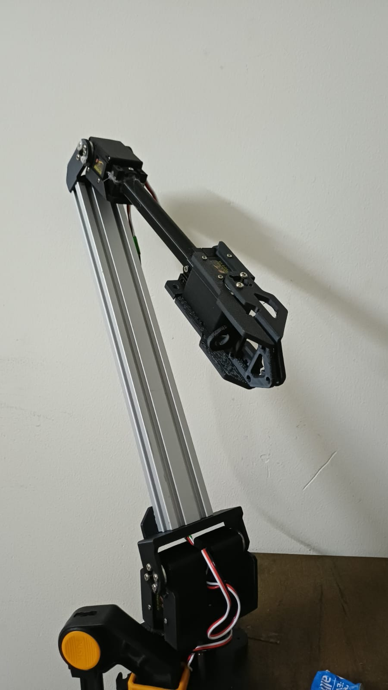
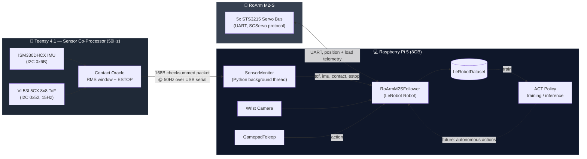
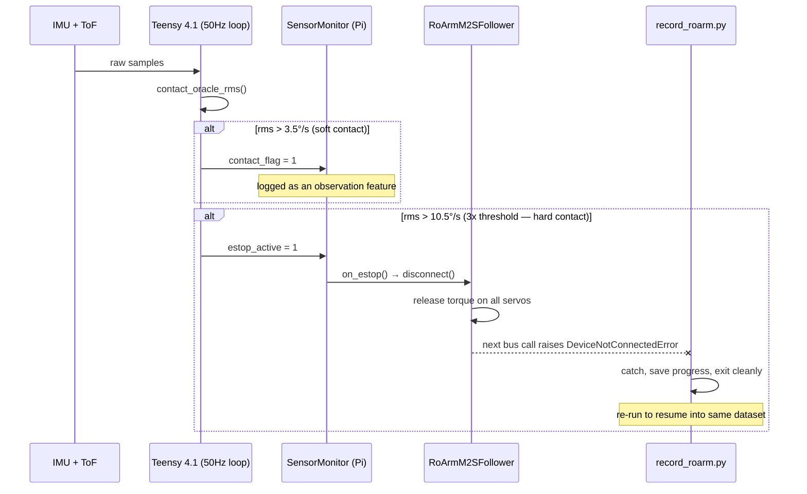

<div align="center">



# VLA Robotic Arm

**A low-cost, contact-aware robotic arm platform for Vision-Language-Action research.**

5-DOF serial-bus arm · Teensy 4.1 sensor co-processor · LeRobot · ACT (Action Chunking Transformer)


</div>

---

## What is this?

A $200-class robotic arm doesn't need a $2,000 force-torque sensor to do contact-rich manipulation — it needs to be *told* when it's touching something. This project turns a 5-servo Waveshare RoArm M2-S into a sensorized imitation-learning platform:

- A **Teensy 4.1 sensor co-processor** fuses a 6-axis IMU and an 8x8 depth array into a real-time contact estimate at 50Hz, streamed over USB as a checksummed binary protocol.
- A **LeRobot robot driver** exposes that sensor stream — depth grid, IMU, per-servo load — as first-class observations alongside the wrist camera and joint state.
- A **gamepad teleoperation pipeline** records language-conditioned demonstrations with built-in scene/lighting rotation, ready to train **ACT (Action Chunking Transformer)** policies.
- Hardware-level **safety**: a hard-contact event triggers an e-stop that releases servo torque before any higher-level software even notices.

---

## System Architecture



---

## Hardware

| Component | Spec | Role |
|---|---|---|
| **Manipulator** | Waveshare RoArm M2-S, 5x Feetech STS3215 (12V, 30 kg·cm) | Base yaw, coupled-shoulder pitch, elbow/wrist pitch, gripper |
| **Sensor co-processor** | Teensy 4.1 (600MHz Cortex-M7) | 50Hz contact-aware sensor fusion, USB serial telemetry |
| **IMU** | ISM330DHCX | End-effector vibration / contact detection |
| **Depth** | VL53L5CX, 8x8 zones @ 15Hz | Wrist-mounted grasp-depth sensing |
| **Compute** | Raspberry Pi 5 (8GB) | LeRobot driver, teleop, recording, policy training/inference |
| **Camera** | USB/CSI wrist camera | Visual observation for the policy |

> ⚡ **Power isolation rule:** the servo 12V rail and the Pi5/Teensy compute rail are **never shared**. The Teensy runs solely off USB power. Servo current transients on a shared rail can brownout the compute stack mid-control-loop — exactly when the safety system needs to be most reliable.

---

## Safety: The Contact Oracle

Every 20ms, the Teensy computes a rolling RMS of gyroscope readings and classifies it into two tiers:



Safety lives at the lowest practical layer: detection happens on bare metal, and the e-stop response (`disconnect()`) is triggered by the robot object itself — no policy, recording script, or network round-trip is in the loop.

---

## Repository Layout

```
vla_rob/
├── firmware/                  # Teensy 4.1 sensor co-processor (PlatformIO / C++17)
│   ├── src/sensor_safety/     # 50Hz loop, packet protocol, contact oracle
│   ├── src/                   # IMU/ToF drivers, servo bus, waypoint interpolation
│   └── tools/                  # sensor_listener.py (SensorMonitor) + unit tests
├── scripts/
│   ├── record_roarm.py        # Gamepad teleop recording -> LeRobotDataset
│   └── roarm_recording_extras.py  # Task phrases + scene/lighting rotation
├── rpi5_inference/             # Perception, planning, dashboard, calibration
├── dataset/                     # HDF5 dataset tooling, skill segmentation
├── checkpoints/                 # Trained model weights
└── docs/                         # Specs, plans, design docs
```

---

## Getting Started

### 1. Flash the sensor co-processor

```bash
cd firmware
pio run -e teensy41 -t upload
```

### 2. Install the Python stack

```bash
# in your lerobot checkout
pip install -e ".[act,feetech]"
pip install inputs   # gamepad backend for GamepadTeleop
```

### 3. Record demonstrations

```bash
python3 scripts/record_roarm.py \
    --follower_port /dev/roarm_servo \
    --sensor_port /dev/roarm_teensy \
    --repo_id YOUR_HF_USERNAME/roarm_pickplace_v2
```

Each recorded frame includes `observation.tof` (8x8m), `observation.imu` (6,), and `observation.servo_load` (5,) alongside the wrist camera image and joint state — everything ACT needs for contact-aware policies.

---

## Roadmap

- [x] Teensy 4.1 sensor co-processor firmware (IMU + ToF + contact oracle @ 50Hz)
- [x] Checksummed 168-byte sensor protocol + Python `SensorMonitor`
- [x] `RoArmM2SFollower` LeRobot driver with sensor-fused observations
- [x] Gamepad teleop recording pipeline with task/scene rotation
- [ ] Hardware bring-up & udev rules (`/dev/roarm_teensy`, `/dev/roarm_servo`)
- [ ] Collect full 80-episode pick-and-place dataset
- [ ] Train ACT policy on collected demonstrations
- [ ] Evaluate autonomous rollouts with contact-oracle safety net

---

<div align="center">

*Built on <a href="https://github.com/huggingface/lerobot">LeRobot</a> · Firmware targets Teensy 4.1 via PlatformIO*

</div>
