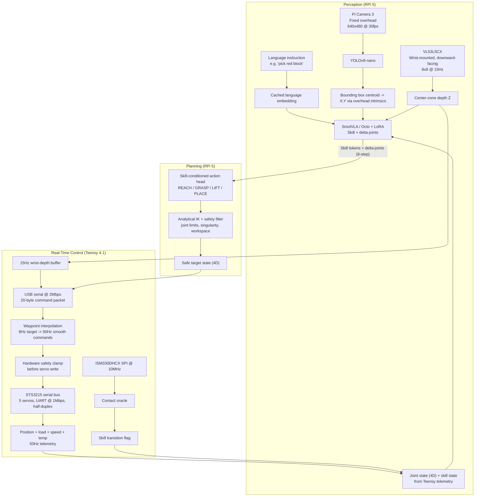
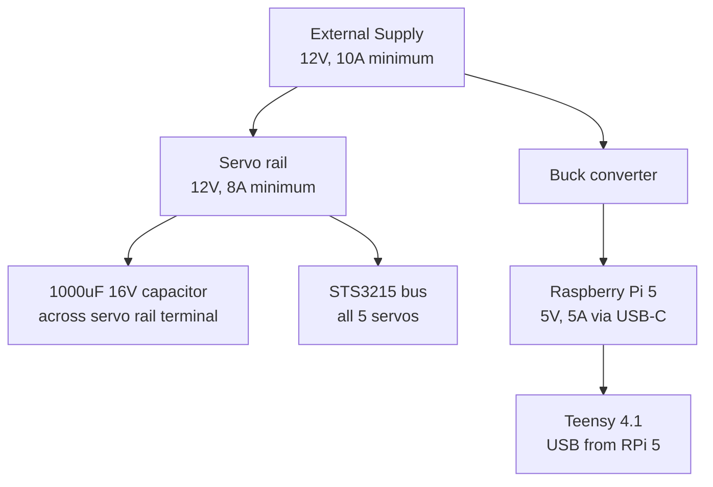
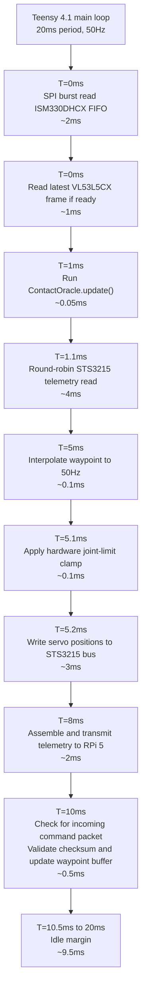

# Vision–Language–Action Control for 4-DOF Robotic Manipulation Using Hierarchical Conditioned Motion Planning with Multi-Modal Contact Sensing

**Author:** Ryan

---

## Table of Contents

1. [Abstract](#1-abstract)
2. [Introduction and Motivation](#2-introduction-and-motivation)
3. [Problem Statement](#3-problem-statement)
4. [Literature Review and Related Work](#4-literature-review-and-related-work)
5. [System Overview](#5-system-overview)
6. [Hardware Architecture](#6-hardware-architecture)
   - 6.1 Manipulator Mechanical Design
   - 6.2 Actuator Specification: STS3215 Serial Bus Servos
   - 6.3 Depth Sensing: VL53L5CX Time-of-Flight Array (Wrist-Mounted)
   - 6.4 Inertial Sensing: ISM330DHCX Industrial-Grade IMU (End-Effector)
   - 6.5 Visual Sensing: Raspberry Pi Camera Module 3 (Fixed Overhead)
   - 6.6 Real-Time Compute: Teensy 4.1 Microcontroller
   - 6.7 High-Performance Compute: Raspberry Pi 5 (8GB)
   - 6.8 Power Architecture
7. [Hierarchical Compute Architecture](#7-hierarchical-compute-architecture)
   - 7.1 Design Philosophy
   - 7.2 Teensy 4.1 Responsibilities
   - 7.3 Raspberry Pi 5 Responsibilities
   - 7.4 Inter-Processor Communication Protocol
8. [Perception Pipeline](#8-perception-pipeline)
   - 8.1 Object Detection: YOLOv8-nano
   - 8.2 3D Object Pose Estimation via Overhead Camera and Wrist ToF
   - 8.3 Language Understanding
9. [Multi-Modal Contact Sensing](#9-multi-modal-contact-sensing)
   - 9.1 STS3215 Load Feedback as Force Proxy
   - 9.2 ISM330DHCX End-Effector Vibration Detection
   - 9.3 Contact Oracle Fusion Algorithm
10. [Hierarchical VLA Pipeline](#10-hierarchical-vla-pipeline)
    - 10.1 Skill Representation
    - 10.2 Visual-Language Skill Predictor: SmolVLA-450M + LoRA, with Octo-small Baseline
    - 10.3 Skill-Conditioned Action Generator
    - 10.4 Multi-Modal Skill Segmentation
11. [Analytical IK Safety Layer](#11-analytical-ik-safety-layer)
    - 11.1 4-DOF Kinematic Model
    - 11.2 Inverse Kinematics Solver
    - 11.3 Safety Enforcement
12. [Real-Time Control Loop](#12-real-time-control-loop)
    - 12.1 Teensy 4.1 Control Loop
    - 12.2 Raspberry Pi 5 Inference Loop
    - 12.3 Latency Budget Analysis
13. [Training Methodology](#13-training-methodology)
    - 13.1 Data Collection via Teleoperation
    - 13.2 Skill Segmentation
    - 13.3 Model Training
14. [Validation and Evaluation](#14-validation-and-evaluation)
    - 14.1 Evaluation Tasks
    - 14.2 Quantitative Metrics
    - 14.3 Ablation Studies
15. [System Integration and Software Stack](#15-system-integration-and-software-stack)
16. [Live Dashboard](#16-live-dashboard)
17. [Real-World Applications](#17-real-world-applications)
18. [Limitations and Future Work](#18-limitations-and-future-work)
19. [Expected Deliverables](#19-expected-deliverables)
20. [Conclusion](#20-conclusion)
21. [References](#21-references)

---

## 1. Abstract

Modern Vision-Language-Action (VLA) models have demonstrated remarkable capabilities in robotic manipulation by directly mapping visual observations and natural language instructions to continuous motor commands. However, their deployment on low-cost, low-DOF robotic hardware exposes critical architectural limitations: regression instability under kinematic constraints, prohibitive data requirements in the range of thousands of demonstrations, complete absence of interpretable reasoning, and incompatibility with real-time safety guarantees required in practical settings.

This project proposes a **Hierarchical VLA architecture with Multi-Modal Contact Sensing and Conditioned Motion Planning**, designed for deployment on a 4-DOF serial-bus servo manipulator built around five 12V STS3215 servos. The architecture addresses four concurrent challenges: sample-efficient learning from as few as 30 teleoperation demonstrations, interpretable skill-level planning via discrete skill tokens (REACH, GRASP, LIFT, PLACE), contact sensing without force-torque sensors using an ISM330DHCX industrial IMU mounted on the end-effector, and accurate 3D object localization by combining a fixed overhead Pi Camera 3 for (X, Y) detection with a wrist-mounted VL53L5CX Time-of-Flight sensor for precise grasp-depth (Z) measurement.

The sensing architecture follows a deliberate hybrid placement strategy: the Pi Camera 3 is fixed overhead on a rigid post to reduce arm occlusion during manipulation, the VL53L5CX is arm-mounted at the wrist pointing downward for direct grasp-depth measurement, and the ISM330DHCX is mounted on the end-effector for high-frequency contact vibration detection. This placement strategy is designed to avoid two common demo failure modes — arm occlusion of a behind-mounted camera, and CSI ribbon cable fatigue from eye-in-hand routing.

The compute stack is partitioned across a **Teensy 4.1 microcontroller** (50Hz deterministic servo control, sensor acquisition, hardware-level safety enforcement) and a **Raspberry Pi 5 8GB** (target 8Hz VLA inference, YOLOv8-nano detection, language encoding, analytical IK planning). The preferred VLA candidate is SmolVLA-450M because it is designed for affordable robotics and CPU-capable deployment; Octo-small + LoRA is retained as a lower-latency fallback baseline if Raspberry Pi 5 benchmarking shows SmolVLA cannot reliably meet the 125ms per-step budget. Validation targets include ≥80% task success on structured pick-place, stacking, and language-conditioned sorting, with 100% workspace-compliant trajectories.

The planned contribution is a documented VLA deployment on the STS3215 serial-bus ecosystem, a cost-effective multi-modal contact detection method using ISM330DHCX gyroscope vibration analysis, and a hierarchical embedded architecture applicable to MSME automation, agricultural sorting, and accessible robotics education.

---

## 2. Introduction and Motivation

### 2.1 The Promise of Vision-Language-Action Models

The emergence of large-scale robot learning has produced Vision-Language-Action (VLA) models capable of interpreting natural language instructions and translating them directly into robot motor commands without hand-crafted task-specific code. Foundational models such as RT-2 [1], Octo [2], and OpenVLA [3] have demonstrated that pretrained visual-language representations can be efficiently fine-tuned for manipulation tasks, significantly reducing the engineering burden of traditional modular pipelines that decompose manipulation into detection, pose estimation, path planning, and execution as separate, brittle modules.

The appeal of VLA models for practical robotics is multifaceted. A technician in a manufacturing environment can instruct a robot arm in plain language — "place the red component in tray three" — without programming, without predefined object models, and without reconfiguring a pipeline. This generality, if realized on affordable hardware, represents a step change in accessible automation for small and medium enterprises, educational institutions, and research groups with limited resources.

### 2.2 The Deployment Gap

Despite this promise, VLA models have been primarily demonstrated on expensive, high-DOF research platforms: 6-7 DOF arms with wrist-mounted force-torque sensors, high-resolution multi-camera setups, and workstation-class GPUs for inference. The deployment gap to affordable hardware — arms costing under $200, running on a Raspberry Pi — has not been systematically closed in published literature.

The STS3215 serial-bus servo ecosystem, used widely in educational and MSME robotic arms, provides a rich onboard telemetry stream (position, velocity, load current, temperature, voltage) that no published VLA work has exploited. Load feedback in particular serves as a natural proxy for contact force, offering a path to contact-rich manipulation without dedicated force-torque sensors.

### 2.3 This Project's Position

This project occupies a specific and underexplored position in the literature: a VLA system designed ground-up for a 4-DOF, five-servo STS3215 serial-bus arm, running on a Raspberry Pi 5 with a Teensy 4.1 real-time co-processor, using only 30 teleoperation demonstrations for initial training, and integrating three sensors (Pi Camera 3 fixed overhead, VL53L5CX wrist-mounted, ISM330DHCX end-effector) in a unified perception and contact sensing pipeline. The central hypothesis is that hierarchical decomposition of manipulation into interpretable skill tokens, combined with multi-modal sensor fusion and analytical IK safety, is sufficient to achieve robust, safe manipulation on an affordable platform without scaling to thousands of demonstrations or expensive additional hardware.

---

## 3. Problem Statement

### 3.1 Fundamental Limitations of Flat VLA on Low-DOF Arms

Flat end-to-end VLA architectures — those mapping raw pixels and language directly to joint deltas without intermediate representations — exhibit four critical failure modes when deployed on low-DOF arms:

**Regression Instability:** High-DOF arms (6-7 DOF) possess kinematic redundancy that allows multiple joint configurations to reach any given end-effector pose. This redundancy provides a form of action smoothing — small perturbations in predicted joint values rarely produce catastrophic end-effector deviations. A 4-DOF arm has no such redundancy; the joint-to-pose mapping is nearly injective, meaning small errors in joint prediction from the neural network produce large Cartesian deviations at the end-effector. Flat VLA models trained on high-DOF demonstrations are poorly calibrated to this regime.

**Prohibitive Data Requirements:** Large VLA models achieve generalization by training across very large multi-robot datasets and typically still require target-domain demonstrations for reliable deployment. For resource-constrained labs and educational settings collecting demonstrations with a single low-cost arm, even 100+ carefully collected demonstrations can be time-consuming. This project therefore uses 30 demonstrations as an initial sample-efficiency target and evaluates whether hierarchical skill conditioning can make that data budget viable.

**Absence of Interpretability:** Flat VLA models produce joint deltas with no intermediate reasoning that a human operator can inspect. When a task fails — "pick red block" ends with the arm hitting the table — there is no mechanism to determine whether the failure originated from incorrect language grounding, incorrect object localization, a poorly predicted reach trajectory, or a failed grasp. This opacity makes debugging, improvement, and deployment validation extremely difficult.

**Safety Violations:** Unconstrained neural network outputs do not respect joint limits, singularity avoidance constraints, or workspace boundaries. On a physical arm, a single out-of-range joint prediction can result in mechanical damage, unexpected collisions, or rapid uncontrolled movement. Without a dedicated safety enforcement layer, flat VLA models cannot be responsibly deployed on physical hardware.

### 3.2 Sensor Placement and Utilization Challenges

Standard sensor placement conventions fail for a 4-DOF arm in predictable ways. A camera mounted behind and above the arm base is partially occluded by the shoulder and elbow links throughout the REACH phase — exactly when object localization is most critical. A camera mounted eye-in-hand requires routing a fragile CSI ribbon cable through revolute joints, which fatigues within tens of operational cycles and produces catastrophic mid-demo failures.

The STS3215 serial bus protocol additionally provides rich onboard telemetry — 12-bit position (0.088°/step), raw load current as a torque proxy, joint velocity, operating temperature, and supply voltage — at up to 50Hz per servo. No published VLA architecture has incorporated this data as part of the skill representation or contact detection pipeline.

### 3.3 The Core Research Question

The central challenge addressed by this project is:

> *How can stable, language-conditioned pick-and-place manipulation be achieved on an affordable four-DOF serial-bus servo arm using only 30 initial teleoperation demonstrations, while providing interpretable skill-level reasoning, multi-modal contact sensing without force-torque sensors, accurate 3D object localization without RGB-D cameras, and analytical safety constraints — all running at practical embedded rates with a sensor placement strategy designed for demo reliability?*

---

## 4. Literature Review and Related Work

### 4.1 Vision-Language-Action Models

**RT-2 (Robotic Transformer 2)** [Brohan et al., 2023] demonstrated that visual-language model weights pretrained on internet-scale data can be fine-tuned to produce robot actions, achieving impressive zero-shot generalization. However, RT-2 requires Google's robotic manipulation infrastructure (7-DOF arms, distributed GPU training) and 100k+ demonstrations, making it inaccessible for resource-constrained deployment.

**Octo** [Team et al., 2024] introduced a smaller, open-source transformer-based robot policy pretrained on the Open X-Embodiment dataset. Octo-small (~27M parameters) can be fine-tuned on new robot embodiments with a few hundred demonstrations and is a strong fallback for low-latency embedded inference.

**SmolVLA** [Shukor et al., 2025] introduced a compact 450M-parameter VLA designed specifically for affordable robotics, consumer hardware, and asynchronous action execution. Because this project prioritizes low-cost hardware, small datasets, and chunked action generation, SmolVLA-450M is the preferred primary model candidate, subject to Raspberry Pi 5 latency benchmarking.

**OpenVLA** [Kim et al., 2024] open-sourced a 7B parameter VLA model based on Prismatic-7B. While powerful, OpenVLA's inference and fine-tuning requirements are not aligned with Raspberry Pi 5 deployment and are therefore treated as a comparison point rather than the deployment model.

### 4.2 Sample-Efficient Robot Learning

**LoRA (Low-Rank Adaptation)** [Hu et al., 2021] enables parameter-efficient fine-tuning of large models by adding low-rank update matrices to existing weight matrices, typically updating only a small fraction of total parameters. Applied to SmolVLA-450M or Octo-small with rank 8-16 adapters on attention and feedforward layers, this preserves pretrained visual-language representations while reducing the amount of task-specific training required. This makes 30 demonstrations a plausible initial target, though final convergence must be verified empirically.

**Action Chunking** [Chi et al., 2023, Diffusion Policy] demonstrated that predicting multi-step action sequences (chunks) rather than single-step deltas significantly improves temporal consistency. This project generates 8-step action chunks (0.25s at 8Hz) from the skill-conditioned action head.

### 4.3 Hierarchical Robot Learning

**LISA and SayCan** [Ahn et al., 2022] demonstrated that grounding language instructions in skill-level abstractions before generating low-level motor commands improves task success and enables compositional generalization. This hierarchical structure directly motivates the skill token representation in this project.

**PRISE** [Zheng et al., 2024] introduced temporal action abstraction through skill codebooks learned from demonstration data. This project's discrete skill tokens (REACH, GRASP, LIFT, PLACE) represent a domain-specific instantiation of this concept, where skill boundaries are defined by physically interpretable thresholds rather than learned discretization.

### 4.4 Contact Detection Without Force-Torque Sensors

Force-torque sensors suitable for robot manipulation cost $500–2000, making them impractical for low-cost platforms. Alternatives have been explored in literature:

**Motor Current Estimation** uses drive current as a torque proxy [Wahrburg et al., 2018], analogous to the STS3215 load feedback used in this project.

**IMU-Based Contact Detection** on end-effectors has been demonstrated for impact detection in industrial assembly [Luo et al., 2021], exploiting the vibration transient that occurs at first contact. This project applies this principle with the ISM330DHCX industrial IMU mounted on the end-effector, operating at 6.667kHz gyroscope ODR to resolve transients on the order of a few milliseconds.

### 4.5 Depth Fusion for Manipulation

Traditional RGB-D manipulation uses structured light (RealSense D435, ~$150) or stereo disparity. This project estimates 3D object localization through a two-sensor split: a fixed overhead Pi Camera 3 provides (X, Y) position from top-down geometry, while a wrist-mounted VL53L5CX provides precise Z depth at the pre-grasp hover position. This approach eliminates zone-to-pixel extrinsic calibration complexity, should produce more accurate grasp-depth measurements than a fixed-angle ToF sensor, and costs approximately $15 in depth sensing hardware versus $150 for an RGB-D camera.

### 4.6 Gaps Addressed by This Work

This project addresses five gaps not simultaneously covered in existing literature:
1. VLA deployment on STS3215 serial-bus servo ecosystems exploiting onboard load telemetry
2. ISM330DHCX end-effector vibration contact detection at 6.667kHz ODR integrated into a VLA skill transition mechanism
3. Overhead camera plus wrist-mounted ToF two-sensor 3D pose estimation for manipulation without RGB-D cameras
4. Dual-processor (MCU + SBC) architecture for real-time VLA on embedded hardware
5. Sensor placement strategy designed explicitly for demo reliability across revolute-joint manipulation platforms

---

## 5. System Overview

The complete system is organized as three interacting layers that operate concurrently:

**Hardware Layer:** A 4-DOF robotic arm driven by five 12V STS3215 serial-bus servos: one base-yaw servo, two mechanically coupled shoulder servos acting as one high-torque pitch joint, one elbow/wrist pitch servo, and one gripper servo. The arm is equipped with a VL53L5CX depth sensor array at the wrist pointing downward toward the gripper, an ISM330DHCX IMU on the end-effector, and a Pi Camera Module 3 mounted on a rigid overhead post pointing straight down at the workspace.

**Real-Time Layer:** A Teensy 4.1 microcontroller executing a 50Hz deterministic control loop — reading sensor data, computing contact oracle outputs, interpolating waypoints, enforcing joint limit safety, and driving the servo serial bus — completely independent of operating system scheduling.

**Inference Layer:** A Raspberry Pi 5 (8GB RAM) running the full ML pipeline — YOLOv8-nano object detection on overhead RGB frames, language encoding, SmolVLA-450M + LoRA or Octo-small + LoRA VLA inference, 3D pose estimation from overhead (X, Y) and wrist ToF (Z), and analytical IK planning — at a target 8Hz, publishing target joint waypoints to the Teensy over USB serial.

The complete data flow is illustrated below:



---

## 6. Hardware Architecture

### 6.1 Manipulator Mechanical Design

The manipulator is a 4-DOF serial chain arm with five physical servos. Two STS3215 servos are mechanically coupled and commanded together, so they act as one logical shoulder joint.

| Joint | Axis | Actuator | Notes |
|---|---|---|---|
| J0 — Base Rotation | Yaw | 1× STS3215 | 30 kg.cm stall torque at 12V |
| J1 — Shoulder Flexion | Pitch | 2× STS3215 coupled | Mechanically coupled pair acting as one joint, ~60 kg.cm combined stall torque at 12V |
| J2 — Elbow/Wrist Pitch | Pitch | 1× STS3215 | Positions the gripper above the object for top-down approach |
| J3 — Gripper Open/Close | Gripper jaw motion | 1× STS3215 | End-effector actuation; included as the fourth controllable DOF |

The four independently controllable variables are therefore base yaw, shoulder pitch, elbow/wrist pitch, and gripper opening. For Cartesian pose planning, J0-J2 define the end-effector approach position, while J3 controls grasp state and does not change the arm's spatial kinematic chain.

**Shoulder Design Rationale:** The shoulder pitch joint bears the largest gravitational moment because it supports all downstream links and the payload. A single 12V STS3215 provides 30 kg.cm stall torque, which is marginal for a fully extended arm with payload. Two servos coupled on the shoulder axis double the available stall torque to approximately 60 kg.cm while sharing load current and reducing thermal stress on individual motors. Both shoulder servos are assigned unique bus IDs and receive identical position commands from the Teensy, with load readings averaged for control feedback.

**Workspace:** Approximate reach radius of 35–40cm from base center, workspace height 0–30cm above table, angular reach ±150° in yaw. Specific workspace limits are determined during calibration and encoded in the IK safety layer.

### 6.2 Actuator Specification: STS3215 Serial Bus Servos

The Feetech STS3215 is chosen as the primary actuator for the following reasons:

**Torque:** The selected 12V STS3215 variant provides approximately 30 kg.cm stall torque per servo. The coupled shoulder pair provides approximately 60 kg.cm combined stall torque, giving useful margin for lightweight aluminum/printed links and payloads up to approximately 200g, subject to validation with the final arm mass and link lengths.

**Position Resolution:** 4096 steps per revolution (12-bit encoder), corresponding to 0.088° per step. This resolution is sufficient for pick-and-place manipulation but not precision assembly tasks.

**Serial Bus Protocol:** All servos share a single half-duplex UART bus at 1Mbps. Each servo is individually addressable by an 8-bit ID, enabling broadcast and selective commands from a single Teensy UART peripheral. Half-duplex operation requires the Teensy to manage TX/RX direction control, which is handled natively in firmware using a direction-control GPIO line.

**Onboard Telemetry:** Each STS3215 reports the following over the same serial bus on read request: present position (12-bit), present speed (11-bit with direction), present load (10-bit, proportional to motor current), present voltage (8-bit, 0.1V/LSB), and present temperature (8-bit, 1°C/LSB). At 50Hz polling with five servos, the total bus utilization remains below 40% of available bandwidth, leaving margin for command writes.

**Thermal Protection:** Hardware overcurrent cutoff activates at 80°C motor temperature, providing passive protection against stall damage during grasping. The Teensy monitors temperature telemetry and implements a software warning threshold at 65°C.

### 6.3 Depth Sensing: VL53L5CX Time-of-Flight Array (Wrist-Mounted)

The STMicroelectronics VL53L5CX is a solid-state ToF sensor providing either a 4×4 grid of 16 zones or an 8×8 grid of 64 zones using a single-photon avalanche diode (SPAD) array with 940nm VCSEL illumination. This project uses **8×8 mode at 15Hz** because grasp-depth accuracy benefits more from spatial resolution than from 60Hz depth updates. The Teensy forwards the latest valid ToF frame in every 50Hz telemetry packet, along with a ToF timestamp, so the RPi 5 can distinguish fresh depth data from a repeated sample.

- **Ranging distance:** 2cm to 400cm (operating range for wrist grasp sensing: 2–30cm)
- **Zone angular resolution:** 8° per zone (63° total diagonal FOV)
- **Update rate:** 8×8 mode up to 15Hz, 4×4 mode up to 60Hz; this project uses 8×8 at 15Hz
- **Range accuracy:** ±5mm typical at 200mm range under ambient light
- **Interface:** I2C at up to 1MHz, operating at 400kHz on the Teensy 4.1 Wire peripheral

**Mounting — Wrist-Downward:** The VL53L5CX is mounted on a compact bracket affixed near the gripper/end-effector bracket, oriented to point directly downward toward the gripper and object below. Four 22AWG silicone-insulated wires (SDA, SCL, 3.3V, GND) are routed along the arm linkages using small cable clips, tolerating continuous flexion through joints without fatigue — a fundamentally different mechanical situation from a CSI ribbon cable.

This mounting strategy serves two functions. During the REACH phase, as the arm moves toward the target object, the wrist ToF reads the decreasing distance to the object as the end-effector descends toward pre-grasp height. At the pre-grasp hover point — when the arm has reached the (X, Y) position determined from the overhead camera — the four center zones of the ToF grid read the direct vertical distance from wrist to object surface, providing the Z coordinate for the complete 3D pick pose. This measurement is far more accurate than any fixed-angle ToF calibration approach because the sensor is positioned directly above the grasp point at measurement time.

**Calibration:** A one-time wrist height calibration places a flat reference board on the table surface and records the ToF center zone reading. This single measurement establishes the wrist-to-table offset, enabling absolute grasp depth from any subsequent center zone reading.

### 6.4 Inertial Sensing: ISM330DHCX Industrial-Grade IMU (End-Effector)

The STMicroelectronics ISM330DHCX is an industrial-grade 6-DOF IMU integrating a 3-axis MEMS accelerometer and 3-axis MEMS gyroscope, specifically designed for robotics and industrial applications requiring high throughput, thermal stability, and mechanical shock resistance. It represents the industrial variant of the LSM6DSO family with extended specifications.

**Why ISM330DHCX over general-purpose IMUs:** The contact oracle algorithm (Section 9.2) operates by detecting the RMS spike in a sliding gyroscope window that occurs when the gripper first contacts an object. This transient has a characteristic duration of 50–200ms but manifests as a brief initial spike within the first few milliseconds of contact. The ISM330DHCX supports a 6.667kHz gyroscope ODR, so a 20-sample RMS window spans approximately 3.0ms. General-purpose IMUs operating at 1,125Hz (e.g., ICM-20948) would produce a 20-sample window spanning 17.8ms, potentially smearing the transient peak. The low gyro noise floor enables a tight contact threshold without false positive triggers from normal motion noise.

**Rationale for Excluding Magnetometer-Based IMUs:** The servo motors around the end-effector generate dynamic magnetic fields under load (1–3A per motor). A magnetometer placed within 10cm of these motors would read corrupted, unusable data. IMUs with integrated magnetometers (such as the ICM-20948 with its AK09916) carry the added cost and complexity of a sensor that is both physically unreliable and architecturally unnecessary in this application — the contact oracle requires only gyroscope data, and the fixed camera eliminates any need for arm orientation tracking.

**Mounting — End-Effector:** The ISM330DHCX is mounted directly on the gripper bracket, as close to the gripper jaw as mechanical constraints allow. SPI wires (MOSI, MISO, SCK, CS, 3.3V, GND) are routed alongside the ToF I2C wires using the same cable management path. This placement maximizes the amplitude of the contact vibration signal, as the transient propagates from the gripper jaw contact surface directly into the IMU mount point with minimal structural damping.

**Operating Configuration:**

| Parameter | Setting |
|---|---|
| Gyroscope ODR | 6,667Hz (maximum high-performance rate used for contact detection) |
| Gyroscope FS range | ±250°/s |
| Accelerometer ODR | 6,667Hz |
| Accelerometer FS range | ±2g |
| Interface | SPI at 10MHz (Teensy 4.1 SPI0) |
| FIFO | Up to 9kB hardware FIFO, burst-read at 50Hz intervals |
| Gyro noise floor | 3.8 mdps/√Hz |
| Shock rating | 70g operational |

**FIFO Strategy:** The IMU FIFO stores raw sensor words, not floating-point samples. With 3-axis gyroscope and 3-axis accelerometer enabled, each timestamp-free 6-axis sample is 12 bytes (6 channels × 16 bits). At 6.667kHz, the raw stream is approximately 80kB/s. A 9kB FIFO therefore holds roughly 112ms of 6-axis data, or longer if only gyroscope samples are pushed into the FIFO. Reading the FIFO every 20ms at 50Hz requires transferring approximately 1.6kB per cycle, well within a 10MHz SPI budget. The Teensy converts raw samples to physical units after the burst read, processes gyro RMS for contact detection, and forwards only summary IMU values plus contact metrics in the 50Hz telemetry packet.

### 6.5 Visual Sensing: Raspberry Pi Camera Module 3 (Fixed Overhead)

The Raspberry Pi Camera Module 3 uses a Sony IMX708 12.3MP image sensor with a 66° diagonal field-of-view. For this project, the camera operates at 640×480 resolution at 30fps, connected directly to the Raspberry Pi 5 via the MIPI CSI-2 interface.

**Mounting — Fixed Overhead, Top-Down:** The camera is mounted on a rigid vertical post approximately 50cm above the table surface, oriented to point directly downward at the workspace. The post is fixed to the table or a stable external structure, completely decoupled from the arm mechanically. The CSI ribbon cable runs straight from camera to Raspberry Pi 5 with no joint crossings — it is never flexed during operation.

**Why Overhead Mounting is Architecturally Superior:**

*Occlusion reduction:* From directly above, the arm links appear as thin silhouettes occupying a smaller fraction of the frame than in a behind-mounted view. Objects on the table beside or ahead of the arm are expected to remain visible through most REACH, GRASP, LIFT, and PLACE phases. A behind-mounted camera is more likely to be partially occluded by the shoulder and elbow links throughout REACH, which is precisely when the VLA model needs live object position data most.

*Calibration simplicity:* Top-down perspective maps object positions to (X, Y) coordinates through simple pinhole projection with a known table-height Z. The mapping from pixel centroid to workspace coordinate is computed directly without geometric ambiguity, perspective correction, or multi-angle calibration.

*Training distribution consistency:* All 30 teleoperation demonstrations and all evaluation trials share the identical camera perspective, focal length, and field of view. There is zero domain shift between training data and deployment.

*Alignment with industrial practice:* Overhead fixed cameras are the standard perception arrangement in Amazon warehouse pick robots, all commercial bin-picking systems, and tabletop manipulation research (e.g., Google RT-1, Octo demo setups). This is not a compromise — it is the established best practice.

Camera intrinsic calibration is performed using a 9×6 checkerboard pattern and OpenCV's `calibrateCamera` function, producing a calibration matrix K and distortion coefficients stored as a YAML file loaded at startup.

### 6.6 Real-Time Compute: Teensy 4.1 Microcontroller

The Teensy 4.1 is based on the NXP IMXRT1062 Cortex-M7 processor running at 600MHz with a hardware floating-point unit and DSP extensions. It is chosen for this project over alternatives (STM32, Arduino Mega) for the following reasons:

- 600MHz Cortex-M7 with FPU: sufficient for real-time DSP including IMU contact oracle RMS computation
- 7 hardware UARTs: UART1 for STS3215 bus, UART2 for RPi 5 communication, others reserved
- 3 SPI buses, 3 I2C buses: SPI0 for ISM330DHCX, Wire1 for VL53L5CX
- 1MB SRAM: sufficient for 9kB IMU FIFO buffer, ToF frames, telemetry structs, and firmware
- Native USB HS (480Mbps): clean, low-latency communication to RPi 5
- No OS: deterministic bare-metal execution, no scheduler jitter

The Teensy runs custom firmware written in C++ using the Teensyduino framework for peripheral access and Arduino-compatible library compatibility.

### 6.7 High-Performance Compute: Raspberry Pi 5 (8GB)

The Raspberry Pi 5 with 8GB LPDDR4X RAM runs Ubuntu 24.04 LTS (64-bit) as the primary inference platform. Its quad-core Cortex-A76 at 2.4GHz provides sufficient throughput for real-time neural network inference at 8Hz when models are quantized and compiled to TorchScript.

The 8GB RAM configuration is specifically chosen to allow simultaneous in-memory loading of all inference models without swapping:

| Model | Approximate RAM |
|---|---|
| YOLOv8-nano (FP16) | ~30MB |
| Language encoder | ~100-300MB, depending on selected SmolVLA/Octo pipeline |
| SmolVLA-450M + LoRA (quantized target) | Benchmark required; expected to fit in 8GB RAM |
| Octo-small + LoRA fallback (FP16) | ~1.1GB |
| OS + Python runtime | ~800MB |
| Dataset buffer (30 demos) | ~200MB |
| **Total** | **~2.4GB** |

The remaining ~5.6GB provides operating margin for buffer allocation, camera frames, and the live GUI dashboard.

### 6.8 Power Architecture

Clean power distribution is critical. Servos under load create voltage spikes that, on shared power rails, cause RPi 5 brownouts.



The servo and compute rails are separated at the power-distribution level and share only the required common ground for communication. A 1000µF electrolytic capacitor placed across the servo power rail at the terminal block absorbs short motor transients from braking and stall events, reducing the risk of servo current spikes resetting the RPi 5.

---

## 7. Hierarchical Compute Architecture

### 7.1 Design Philosophy

The fundamental constraint of real-time robotic control is that servo commands must arrive with deterministic timing. A 50Hz control loop requires one command packet every 20ms, with a maximum allowable jitter of approximately 2ms before motion artifacts become visible. The Linux kernel, even with `PREEMPT` patches, introduces worst-case scheduling latencies of 10–50ms under CPU load — completely incompatible with servo control when the CPU is simultaneously running neural network inference.

The solution is a strict compute hierarchy: the Teensy 4.1 owns all timing-critical operations on bare metal, while the Raspberry Pi 5 owns all computationally intensive operations under Linux. The Teensy does not depend on the RPi 5 for control loop execution — if the RPi 5 takes 200ms instead of 125ms on an inference step, the Teensy continues executing the last-received waypoints through smooth interpolation. This decoupling guarantees physical arm smoothness independent of inference load. This architecture mirrors the compute partitioning used in professional robotics platforms such as those built by Boston Dynamics, Clearpath, and industrial manipulation vendors.

### 7.2 Teensy 4.1 Responsibilities

The Teensy executes the following tasks in a single 20ms (50Hz) main loop:

**Task 1 — Sensor Acquisition (Priority: Highest):**
At the top of each 20ms cycle, the Teensy performs a partial FIFO read from the ISM330DHCX via SPI burst. The VL53L5CX runs autonomously in 8×8 mode at 15Hz; when a new frame-ready interrupt is available, the Teensy reads the latest ToF frame into a buffer. Each 50Hz telemetry packet includes the most recent ToF frame and its timestamp, so the RPi 5 can use fresh depth when available and safely reuse the last valid depth between 15Hz updates.

**Task 2 — Contact Oracle (Priority: High):**
The ISM330DHCX gyro FIFO data is processed for RMS vibration magnitude over the last 20 samples (~3.0ms window at 6.667kHz). If the RMS exceeds the calibrated contact threshold, the contact flag is set immediately, triggering a skill state transition flag available to the servo control task. This computation runs in approximately 0.05ms on the Cortex-M7 FPU.

**Task 3 — Waypoint Interpolation:**
The RPi 5 sends target joint positions at 8Hz. The Teensy maintains a ring buffer of the two most recent RPi 5 commands and performs linear interpolation between them at 50Hz, producing smooth 20ms motion commands even with irregular inference timing from the RPi 5.

**Task 4 — Hardware Safety Enforcement:**
Every computed joint command (post-interpolation) is clamped to the calibrated joint limits before being written to the servo bus. This enforcement occurs on every single 20ms cycle regardless of what the RPi 5 has sent.

**Task 5 — STS3215 Bus Polling:**
Position, load, and speed are read from all five physical servos once per 20ms control period. If bus timing measurements show this is too tight, the firmware must explicitly document a staggered fallback with a lower per-servo telemetry rate instead of silently changing the packet contract.

**Task 6 — Telemetry Transmission:**
At 50Hz, a 250-byte telemetry struct (defined in Section 7.4) is transmitted to the RPi 5 over USB serial, carrying all sensor data needed for the inference pipeline. ToF values update at 15Hz inside that stream and are explicitly timestamped.

### 7.3 Raspberry Pi 5 Responsibilities

The RPi 5 executes the VLA inference pipeline as a Python 3.11 process with the following thread allocation:

**Main Inference Thread (8Hz target):**
Reads latest telemetry from USB serial, runs the full perception and planning pipeline, writes command packets back to the Teensy.

**Camera Capture Thread (30fps):**
Continuously reads frames from the Pi Camera 3 via libcamera, maintaining a ring buffer. The inference thread grabs the latest available frame without blocking.

**GUI Thread:**
Updates the live dashboard at 10Hz, displaying overhead camera feed with detections, wrist ToF depth reading, skill timeline, IMU vibration signal, servo load graphs, and safety status.

The inference thread and camera thread communicate through a thread-safe shared frame buffer. Python's GIL is managed by keeping the camera thread predominantly in C-extension code (libcamera, NumPy operations).

### 7.4 Inter-Processor Communication Protocol

USB Serial at 2Mbps carries binary-packed structs in both directions.

**Teensy → RPi 5 Telemetry Packet (250 bytes, 50Hz):**

```c
typedef struct __attribute__((packed)) {
    uint32_t timestamp_us;     // Microsecond timestamp from Teensy systick
    float    servo_pos[5];     // Physical servo positions in degrees (0.088° resolution)
    float    servo_load[5];    // Physical servo load, normalized 0.0–1.0
    float    servo_speed[5];   // Physical servo speed in degrees/second
    float    servo_temp[5];    // Physical servo temperature in Celsius
    uint16_t tof_grid[64];     // VL53L5CX 8×8 zone distances in mm (wrist-down)
    uint32_t tof_timestamp_us; // Timestamp of most recent ToF frame (15Hz update rate)
    uint8_t  tof_resolution;   // 64 for 8×8 mode, 16 if using 4×4 fallback
    uint8_t  tof_valid;        // 1 if ToF frame passed validity filtering
    float    imu_gyro[3];      // ISM330DHCX gyro in degrees/second (gx, gy, gz)
    float    imu_accel[3];     // ISM330DHCX accel in m/s² (ax, ay, az)
    uint8_t  contact_flag;     // 1 if contact oracle triggered this cycle
    float    contact_rms;      // Current gyro RMS for threshold monitoring
    uint8_t  safety_clamped;   // 1 if hardware safety clamped a command this cycle
    uint16_t checksum;         // Simple sum checksum for packet integrity
} TeensyTelemetry_t;  // 250 bytes when packed
```

**RPi 5 → Teensy Command Packet (20 bytes, 8Hz):**

```c
typedef struct __attribute__((packed)) {
    float   target_arm[3];     // Target J0-J2 arm positions in degrees
    uint8_t skill_state;       // 0=REACH, 1=GRASP, 2=LIFT, 3=PLACE
    uint8_t execute;           // 1=execute motion, 0=hold current position
    float   gripper_command;   // 0.0=fully open, 1.0=fully closed
    uint8_t emergency_stop;    // 1=immediate halt all servos
    uint8_t checksum;
} RPiCommand_t;  // 20 bytes when packed
```

At 2Mbps, a 250-byte telemetry packet transmits in approximately 1.0ms — small relative to the 20ms control cycle. Checksum validation on both ends allows graceful handling of occasional USB transmission errors with a hold-last-valid strategy.

---

## 8. Perception Pipeline

### 8.1 Object Detection: YOLOv8-nano

YOLOv8-nano (Ultralytics, 3.2M parameters, ~6.3GFLOPs) is selected as the object detection backbone for the following reasons: its inference time on the Raspberry Pi 5 CPU is approximately 18–22ms per frame at 640×480 input, it achieves mAP50 of 37.3 on COCO, and it supports per-class confidence outputs enabling downstream language grounding by class label matching.

For this project, YOLOv8-nano is used in two modes:

**Fine-tuned detection mode:** For the specific manipulation objects (colored blocks, cylindrical objects, trays), the target is to train a fine-tuned detector on approximately 200 manually annotated images per object class and reach >90% detection confidence in the workspace illumination conditions. Images are captured from the overhead camera position to ensure training-deployment perspective consistency.

**Zero-shot detection mode (future):** CLIP-guided open-vocabulary detection to handle novel objects described in language instructions.

The output of YOLOv8-nano is a set of (class, confidence, bbox) tuples. For pick-and-place tasks, the highest-confidence detection matching the language instruction's target object is selected. The overhead top-down view minimizes aspect ratio variation across object positions, improving detection consistency compared to angled camera perspectives.

### 8.2 3D Object Pose Estimation via Overhead Camera and Wrist ToF

This section describes the 3D pick pose estimation method combining the fixed overhead camera for (X, Y) localization and the wrist-mounted VL53L5CX for Z depth at grasp time. This approach is architecturally simpler, more accurate, and more robust than a fixed-camera zone-mapping calibration scheme.

**Step 1 — (X, Y) from Overhead Camera:**

The overhead camera is calibrated using a 9×6 checkerboard to produce intrinsic matrix K (focal lengths fx, fy; principal point cx, cy) and distortion coefficients. The table surface defines Z = 0 in the camera frame. Since objects sit flat on the table and the camera is directly overhead, all objects are at a known depth Z_table from the camera:

```python
def overhead_xy(bbox_centroid, K, Z_table):
    """
    Computes workspace (X, Y) from overhead camera bounding box centroid.
    Z_table: known vertical distance from camera to table surface in meters.
    """
    u_c, v_c = bbox_centroid
    fx, fy = K[0, 0], K[1, 1]
    cx, cy = K[0, 2], K[1, 2]

    # Unproject pixel centroid to world (X, Y) using known table depth
    X = (u_c - cx) * Z_table / fx
    Y = (v_c - cy) * Z_table / fy

    return X, Y   # in meters, in camera frame
```

This produces (X, Y) with accuracy limited by lens distortion (corrected by calibration) and bbox centroid accuracy from YOLOv8. At the overhead distance of 50cm, a 5-pixel centroid error (typical for YOLOv8-nano on 30×30mm objects) corresponds to approximately 3mm XY error — well within pick-and-place tolerance.

**Step 2 — (Z) from Wrist ToF at Pre-Grasp Hover:**

The arm first moves to the (X, Y) position at a safe approach height (Z_approach), determined by the IK solver from the overhead pose. Once hovering directly above the object, the four center zones of the wrist-down VL53L5CX grid read the distance from the wrist bracket to the object surface:

```python
def wrist_tof_z(tof_grid, wrist_to_sensor_offset_mm):
    """
    Reads grasp depth from wrist-mounted VL53L5CX center zones.
    wrist_to_sensor_offset_mm: mechanical offset from wrist joint center to sensor.
    """
    # Use 2x2 center zone average for robustness (zones [3,3], [3,4], [4,3], [4,4])
    center_zones = [
        tof_grid[3][3], tof_grid[3][4],
        tof_grid[4][3], tof_grid[4][4]
    ]
    # Reject outliers (reflective surfaces can produce spurious readings)
    valid = [z for z in center_zones if 20 < z < 600]   # 20mm to 600mm valid range
    if not valid:
        return None   # fall back to table height estimate

    Z_sensor_mm = np.mean(valid)
    Z_grasp_mm  = Z_sensor_mm - wrist_to_sensor_offset_mm
    return Z_grasp_mm / 1000.0   # convert to meters
```

**Step 3 — Full 3D Pick Pose:**

```python
def compute_pick_pose(bbox_centroid, K, Z_table, tof_grid, wrist_offset, T_cam_base):
    """
    Returns pick pose in robot base frame (meters).
    T_cam_base: 4×4 homogeneous transform, camera frame → base frame.
                Computed once during setup using 4 known calibration positions.
    """
    X_cam, Y_cam = overhead_xy(bbox_centroid, K, Z_table)

    # Z from wrist ToF (measured at hover, not from overhead camera)
    Z_grasp = wrist_tof_z(tof_grid, wrist_offset)
    if Z_grasp is None:
        Z_grasp = 0.02   # fallback: assume 20mm object height from known table

    pose_cam = np.array([X_cam, Y_cam, Z_table - Z_grasp, 1.0])
    pose_base = T_cam_base @ pose_cam
    return pose_base[:3]   # (X, Y, Z) in base frame, meters
```

**Accuracy Analysis:** The overhead camera at 50cm height with the IMX708 (fx ≈ 700 pixels at 640×480) produces approximately 0.7mm/pixel ground resolution. YOLOv8-nano centroid accuracy of ±5 pixels translates to ±3.5mm XY error. The wrist ToF center zone average at 5–30cm range has ±3mm accuracy. Combined 3D pick pose error is approximately ±5mm — sufficient for grasping objects larger than 15mm diameter, covering all planned evaluation objects (30mm blocks, 25mm cylinders).

### 8.3 Language Understanding

Language handling depends on the deployed VLA. SmolVLA includes its own compact vision-language backbone, while the Octo-small fallback can use a T5-small encoder to convert task descriptions into 512-dimensional instruction embeddings. In both cases, the instruction representation is cached per unique command so repeated inference steps do not repeatedly pay the language-encoding cost.

For manipulation sessions where the instruction does not change between steps (e.g., "pick the red block" throughout an entire pick-place episode), caching removes language encoding from the steady-state 8Hz inference loop.

---

## 9. Multi-Modal Contact Sensing

This section describes the planned contact detection system that eliminates the need for dedicated force-torque sensors. Two complementary signals are fused: STS3215 load feedback and ISM330DHCX gyroscope vibration.

### 9.1 STS3215 Load Feedback as Force Proxy

Each STS3215 servo reports a 10-bit load value (0–1023) proportional to the output H-bridge current, which is itself proportional to output torque. During a grasping motion, the load on J3 (the gripper servo) rises as the gripper encounters the object surface. A threshold-based detector identifies contact:

```python
LOAD_CONTACT_THRESHOLD = 0.35   # 35% of max rated load, calibrated per object class
LOAD_SUSTAINED_CYCLES  = 5      # Contact confirmed after 5 consecutive cycles = 100ms

contact_counter = 0
def load_contact_detect(current_load_norm):
    global contact_counter
    if current_load_norm > LOAD_CONTACT_THRESHOLD:
        contact_counter += 1
    else:
        contact_counter = max(0, contact_counter - 1)
    return contact_counter >= LOAD_SUSTAINED_CYCLES
```

**Limitation:** Load-based detection has approximately 100–200ms latency from first physical contact to confirmed detection, due to the need for sustained loading to distinguish contact from brief transients during motion.

### 9.2 ISM330DHCX End-Effector Vibration Detection

The ISM330DHCX gyroscope running at 6.667kHz ODR captures high-frequency vibration transients at the end-effector with far greater temporal resolution than general-purpose IMUs. On contact, the structural vibration transmitted through the gripper linkage produces a distinctive RMS spike in a 20-sample sliding window spanning approximately 3.0ms:

```python
class ContactOracle:
    """
    ISM330DHCX-based contact detection for end-effector gripper.
    Operating at 6667Hz ODR: 20 samples = approximately 3.0ms window.
    """
    CONTACT_RMS_THRESHOLD   = 3.5   # deg/s, empirically calibrated
    SLIP_VARIANCE_THRESHOLD = 2.0   # deg/s², indicates unstable grasp
    FIFO_ODR_HZ             = 6667  # ISM330DHCX gyro ODR

    def __init__(self):
        # 20 samples @ 6667Hz = approximately 3.0ms detection window
        self.gyro_buffer = collections.deque(maxlen=20)
        self.contact_confirmed = False
        self.contact_timestamp = None

    def update(self, gx, gy, gz, timestamp_us):
        """Called from Teensy telemetry packet at 50Hz, processing latest FIFO batch."""
        magnitude = np.sqrt(gx**2 + gy**2 + gz**2)
        self.gyro_buffer.append(magnitude)

        if len(self.gyro_buffer) < 20:
            return False

        rms = np.sqrt(np.mean(np.array(self.gyro_buffer)**2))

        if rms > self.CONTACT_RMS_THRESHOLD and not self.contact_confirmed:
            self.contact_confirmed = True
            self.contact_timestamp = timestamp_us
            return True

        return self.contact_confirmed

    def grasp_quality(self):
        """
        Returns grasp stability score: 0.0 (slipping) to 1.0 (stable).
        Sustained high-variance gyro signal after contact = slipping grasp.
        """
        if len(self.gyro_buffer) < 20:
            return 0.5
        variance = np.var(list(self.gyro_buffer))
        return float(np.clip(1.0 / (1.0 + variance / self.SLIP_VARIANCE_THRESHOLD), 0, 1))

    def reset(self):
        self.gyro_buffer.clear()
        self.contact_confirmed = False
        self.contact_timestamp = None
```

**Advantage over load-based detection:** The IMU transient is detected within an approximately 3.0ms signal window, with practical trigger latency expected to be bounded by FIFO service and the 20ms Teensy loop. This is still much faster than the 100–200ms typically required for sustained load threshold confirmation, reducing the probability of the gripper over-squeezing a delicate object before the control loop responds.

**Advantage over lower-ODR IMUs:** At 1,125Hz (ICM-20948), a 20-sample window spans 17.8ms — potentially smearing the peak of the contact transient. The ISM330DHCX at 6.667kHz provides a much narrower window, improving sensitivity to brief contacts with elastic objects.

### 9.3 Contact Oracle Fusion Algorithm

The final contact decision fuses both signals using OR-with-confirmation logic — IMU detects first (fast), load confirms (slow but robust):

```python
def fused_contact_oracle(imu_contact, load_contact, imu_grasp_quality):
    """
    Returns: (contact_detected: bool, confidence: float)
    """
    if imu_contact and load_contact:
        # Both agree: high confidence, secure grasp
        return True, 0.9 * imu_grasp_quality + 0.1

    elif imu_contact and not load_contact:
        # IMU fired but load hasn't risen yet: probable contact, pending confirmation
        # Trigger GRASP state but continue gripper closing for confirmation
        return True, 0.6 * imu_grasp_quality

    elif load_contact and not imu_contact:
        # Load threshold exceeded without IMU transient: possible slow contact
        # (soft object, or vibration damped by object material)
        return True, 0.7

    else:
        return False, 0.0
```

The confidence value from the oracle is logged per episode and serves as an additional feature in the skill segmentation algorithm, as described in Section 10.4.

---

## 10. Hierarchical VLA Pipeline

### 10.1 Skill Representation

Manipulation tasks are decomposed into four discrete skills representing distinct interaction phases:

| Skill Token | Definition | Entry Condition | Exit Condition |
|---|---|---|---|
| **REACH** | Move end-effector to pre-grasp pose above target | Arm clear of obstacles, object detected in overhead camera | Wrist ToF reads target Z within 30mm OR arm at pre-grasp height |
| **GRASP** | Close gripper until contact, confirm grasp quality | REACH complete | Contact oracle confirmed (IMU) + grasp quality > 0.6 |
| **LIFT** | Raise arm while maintaining grasp | GRASP confirmed | J1 angle > lift_threshold AND end-effector height > clearance |
| **PLACE** | Move to target location and open gripper | LIFT complete | Target pose reached within tolerance |

This four-skill ontology is a domain-specific simplification of richer skill vocabularies used in general manipulation research. For the pick-place, stacking, and sorting tasks targeted in this project, these four skills are sufficient to represent all required interaction phases.

### 10.2 Visual-Language Skill Predictor: SmolVLA-450M + LoRA, with Octo-small Baseline

**Recommended Base Model:** SmolVLA-450M is the preferred primary VLA candidate for this project because it was designed for affordable robotics, consumer hardware, small-lab data collection, and asynchronous action execution. These assumptions align more closely with a Raspberry Pi + Teensy architecture than 7B-scale VLA models. Its larger parameter count compared with Octo-small may improve language-conditioned manipulation quality, but the Raspberry Pi 5 latency budget must be benchmarked before final deployment.

**Fallback Baseline:** Octo-small (~27M parameters) remains the safest low-latency fallback. If SmolVLA-450M cannot reliably meet the target 8Hz inference loop after quantization, the project should deploy Octo-small + LoRA and report SmolVLA as an evaluated alternative.

**Architecture Modification for This Project:**

The selected VLA action head is adapted into a dual-output policy:
1. A 4-class softmax over skill tokens (REACH, GRASP, LIFT, PLACE)
2. A joint delta prediction head producing 4×8 tensors (J0 base, J1 coupled shoulder, J2 elbow/wrist, J3 gripper, over an 8-step action chunk)

The dual head is initialized from scratch and trained on project-specific demonstrations. The backbone is frozen except for LoRA adapters inserted at selected attention and feedforward layers.

**LoRA Configuration:**

```python
lora_config = LoRAConfig(
    r=16,                        # Rank of low-rank matrices
    lora_alpha=32,               # Scaling factor
    target_modules=['q_proj',    # Apply to attention query projections
                    'v_proj',    # Apply to attention value projections
                    'fc1',       # Apply to first feedforward layer
                    'fc2'],      # Apply to second feedforward layer
    lora_dropout=0.05,
    bias='none'
)
```

For Octo-small, this configuration adds approximately 2.1M trainable parameters to the frozen 27M parameter backbone. For SmolVLA-450M, the exact adapter count depends on the selected target modules and should be reported from the training script. Fine-tuning begins with 30 demonstrations as the initial data budget; if validation skill F1 or task success is poor, the project should expand toward 100 demonstrations rather than overclaiming convergence from 30. The exported deployment format should be benchmarked on the Raspberry Pi 5 before fixing the final control rate.

**Input Specification:**

```
RGB image:        640×480×3, overhead view, normalized to [0,1], resized to 256×256
Joint state:      4-dimensional logical vector [base, shoulder, elbow/wrist, gripper] in degrees, normalized
Skill state:      4-dimensional one-hot vector of current skill
Language token:   Cached instruction embedding from SmolVLA or T5-small fallback
Contact quality:  1-dimensional scalar from grasp quality oracle (during GRASP skill)
Wrist ToF center: 1-dimensional scalar, distance in mm (during REACH → GRASP transition)
```

### 10.3 Skill-Conditioned Action Generator

The skill embedding (output of the softmax head, or the ground-truth skill token during supervised training) modulates the joint delta prediction head through cross-attention, conditioning the predicted action distribution on the current manipulation phase. This ensures that actions predicted during REACH are smooth with large joint displacement magnitudes (moving toward the object), while actions during GRASP have small magnitudes (fine gripper closure) and actions during LIFT have a characteristic J1-upward signature.

The 8-step action chunk is executed by the Teensy over 1 second (8 steps × 125ms), with the Teensy interpolating each chunk at 50Hz. A new chunk is computed by the RPi 5 every 125ms, with the most recent chunk always overwriting the Teensy's interpolation buffer on receipt.

### 10.4 Multi-Modal Skill Segmentation

Converting raw teleoperation demonstrations into labeled skill segments requires a reliable segmentation algorithm. Rather than manual annotation, this project uses automated multi-modal thresholding defined as follows:

```python
# Calibration constants (empirically determined from first 5 demos)
THRESH = {
    'load_contact':  0.30,   # Normalized load threshold for contact detection
    'vel_stop':      5.0,    # deg/s, below this = arm stopped (in GRASP)
    'lift_j1_angle': 45.0,   # degrees, coupled shoulder joint must exceed this for LIFT classification
    'lift_height':   0.08,   # meters, end-effector height for LIFT confirmation
    'tof_approach':  0.05,   # meters, wrist ToF reading below this → entering GRASP
}

def segment_skill(t, joint_pos, joint_vel, joint_load, imu_contact,
                  ee_height, wrist_tof_z):
    """
    Assigns a skill label to each timestep of a demonstration trajectory.
    All signals from Teensy telemetry; ee_height from forward kinematics.
    wrist_tof_z: center zone depth from wrist-mounted VL53L5CX in meters.
    """
    j1_angle    = joint_pos[1]
    grip_load   = joint_load[3]
    arm_vel_rms = np.sqrt(np.mean(joint_vel[:4]**2))

    # REACH: moving toward object, no contact, wrist not yet close
    if (not imu_contact
            and grip_load < THRESH['load_contact']
            and wrist_tof_z > THRESH['tof_approach']):
        return 'REACH'

    # GRASP: wrist over object or contact detected
    elif (imu_contact
          or wrist_tof_z <= THRESH['tof_approach']
          or (grip_load > THRESH['load_contact']
              and arm_vel_rms < THRESH['vel_stop'])):
        return 'GRASP'

    # LIFT: shoulder rising while maintaining load
    elif (j1_angle > THRESH['lift_j1_angle']
          and ee_height > THRESH['lift_height']
          and grip_load > THRESH['load_contact']):
        return 'LIFT'

    else:
        return 'PLACE'
```

A median filter (window=5, 100ms) is applied post-segmentation to remove single-sample noise at skill boundaries. From 30 demonstrations averaging approximately 8 seconds each (400 samples at 50Hz), this produces approximately 12,000 total samples organized into approximately 120 skill segments, sub-sampled to 800 training segments through data augmentation (random temporal cropping, joint noise injection ±0.5°, load noise injection ±3%).

---

## 11. Analytical IK Safety Layer

### 11.1 4-DOF Kinematic Model

The arm has four controllable DOF, but only the first three affect Cartesian end-effector position. The fourth DOF is the gripper open/close servo. The spatial arm chain is parameterized by the Denavit-Hartenberg (DH) convention with the following parameters (measured from CAD/physical arm, refined by calibration):

| Link i | θᵢ | dᵢ (mm) | aᵢ (mm) | αᵢ |
|---|---|---|---|---|
| 1 (base) | q₀ | 65 | 0 | 90° |
| 2 (shoulder) | q₁ | 0 | 130 | 0° |
| 3 (elbow/wrist pitch) | q₂ | 0 | 190 | 0° |

Forward kinematics are computed by chaining the three spatial 4×4 homogeneous transforms, yielding the gripper reference point in the base frame. The gripper servo q₃ is modeled separately as jaw opening and does not add a Cartesian positioning link.

### 11.2 Inverse Kinematics Solver

For the 3-position-DOF arm plus gripper, a closed-form IK solution is derived using geometric decomposition:

1. **Base rotation (q₀):** Computed directly from target X-Y position: `q₀ = atan2(Y_target, X_target)`
2. **Shoulder and elbow/wrist pitch (q₁, q₂):** Solved analytically using the two-link planar manipulator formula with the projected reach in the base-rotation plane.
3. **Gripper (q₃):** Controlled by the skill state and contact oracle rather than by Cartesian IK. REACH and PLACE command open gripper positions; GRASP closes until contact confidence and load thresholds are met.

The closed-form solver produces solutions in approximately 0.1ms, making it suitable for real-time operation with no latency penalty.

### 11.3 Safety Enforcement

Every joint command — whether from the RPi 5 inference pipeline or from the Teensy's own interpolation — passes through a three-stage safety filter before being written to the servo bus:

**Stage 1 — Joint Limit Clamping (Teensy, every 20ms):**
```c
for (int i = 0; i < 5; i++) {
    cmd.joints[i] = constrain(cmd.joints[i],
                              JOINT_LIMITS_MIN[i],
                              JOINT_LIMITS_MAX[i]);
}
```

**Stage 2 — Singularity Check (RPi 5, pre-transmission):**
Singularities occur when J1 + J2 approaches 0° or ±180°. The IK solver detects this from the Jacobian determinant: if `|det(J)| < 1e-4`, the command is modified by nudging q₁ by ±2° to escape the singular configuration.

**Stage 3 — Workspace Boundary Check (RPi 5, pre-transmission):**
```python
WORKSPACE = {
    'x': (-0.38, 0.38),    # meters
    'y': (-0.38, 0.38),    # meters
    'z': (0.02, 0.35),     # meters, min height prevents floor collision
}
if not all(WORKSPACE[ax][0] <= pos[i] <= WORKSPACE[ax][1]
           for i, ax in enumerate('xyz')):
    target_pos = np.clip(target_pos, workspace_min, workspace_max)
```

The combination of these three stages reduces the probability that an invalid neural-network output reaches the servos. Final safety still depends on correct calibration, conservative joint limits, physical end stops, emergency-stop handling, and validation on the assembled hardware.

---

## 12. Real-Time Control Loop

### 12.1 Teensy 4.1 Control Loop



### 12.2 Raspberry Pi 5 Inference Loop

```python
def inference_loop(teensy_serial, camera_buffer, models, state):
    """Target period: 125ms (8Hz)"""
    t0 = time.monotonic()

    # --- READ (2ms) ---
    telemetry  = read_telemetry(teensy_serial)       # 250-byte packet
    rgb_frame  = camera_buffer.latest_frame()        # Overhead, pre-captured

    # --- DETECT (18ms) ---
    detections = models.yolo(rgb_frame)
    target_det = match_detection(detections, state.language_instruction)

    # --- 3D POSE (3ms) ---
    # X, Y from overhead camera intrinsics
    X, Y = overhead_xy(target_det.centroid, state.camera_K, state.Z_table)
    # Z from wrist ToF center zones (pre-buffered on Teensy, 0ms wait)
    Z = wrist_tof_z(telemetry.tof_grid, state.wrist_tof_offset)
    pick_pose_3d = compute_pick_pose_base_frame(X, Y, Z, state.T_cam_base)

    # --- LANGUAGE (0ms if cached; model-specific path if new instruction) ---
    lang_repr = models.encode_instruction_cached(state.language_instruction)

    # --- VLA INFERENCE (70ms) ---
    joint_state = logical_joint_state(telemetry.servo_pos)  # 4 logical DOF from 5 physical servos
    skill_logits, delta_joints = models.vla_policy(
        rgb_frame, lang_repr, joint_state,
        state.skill_state, telemetry.contact_rms,
        Z  # wrist ToF as additional state feature
    )

    # --- SKILL TRANSITION (0.1ms) ---
    if telemetry.contact_flag and state.skill_state == SKILL.GRASP:
        state.skill_state = SKILL.LIFT   # IMU contact-triggered transition

    # --- IK + SAFETY (5ms) ---
    target_joints = ik_safety_layer(
        joint_state[:3] + delta_joints[0][:3],
        pick_pose_3d
    )

    # --- TRANSMIT (1ms) ---
    send_command(teensy_serial, target_joints, state.skill_state)

    elapsed = (time.monotonic() - t0) * 1000
    if elapsed > 125:
        logger.warning(f"Inference overrun: {elapsed:.1f}ms")
```

### 12.3 Latency Budget Analysis

| Stage | Min (ms) | Nominal (ms) | Max (ms) |
|---|---|---|---|
| USB serial read (telemetry) | 1.0 | 1.5 | 3.0 |
| Camera frame acquisition | 0.1 | 0.1 | 0.5 |
| YOLOv8-nano (640×480, CPU) | 15 | 18 | 25 |
| Overhead+wrist ToF pose fusion | 1.0 | 2.0 | 3.0 |
| Language encoding (cached) | 0.0 | 0.0 | 1.0 |
| VLA policy inference (SmolVLA quantized target or Octo fallback) | Benchmark required | 70 target | 110 target |
| Skill transition logic | 0.05 | 0.05 | 0.1 |
| IK + safety layer | 3.0 | 4.5 | 7.0 |
| USB serial write (command) | 0.5 | 0.8 | 1.5 |
| **Total** | **Benchmark required** | **96.95 target** | **151.1 target** |

| Contact Detection Method | Latency |
|---|---|
| ISM330DHCX vibration (IMU oracle) | **~3ms signal window, ≤20ms Teensy-loop trigger target** |
| STS3215 load threshold (confirmation) | ≤ 200ms |
| Fused oracle (IMU-first, load-confirm) | **≤20ms trigger target, ≤200ms confirm** |

The nominal target remains 125ms for 8Hz inference, but the final VLA policy latency must be measured on the Raspberry Pi 5 with the exported checkpoint and quantization settings. If SmolVLA-450M exceeds the budget, the deployment should switch to Octo-small + LoRA or lower the VLA update rate while preserving the Teensy's 50Hz interpolation loop. The Teensy's waypoint interpolation ensures that an occasional overrun cycle does not produce a physical control glitch — the arm continues executing the previous waypoint chunk smoothly.

---

## 13. Training Methodology

### 13.1 Data Collection via Teleoperation

Teleoperation is performed using a gamepad-controlled interface streaming target joint positions to the Teensy at 50Hz. The operator performs pick-place demonstrations on a tabletop workspace with three object types:

- Colored wooden blocks (30×30×30mm, red, blue, yellow)
- Cylindrical objects (25mm diameter, 50mm height)
- Small rectangular trays (100×60mm) as placement targets

For each of three task types (single-object pick-place, block stacking, color-sorted pick-place), 10 demonstrations are collected, yielding 30 total demonstrations. Each demonstration is recorded with synchronized: overhead RGB frames at 30fps, Teensy telemetry (servo pos/load/speed/temp, ISM330DHCX IMU summary, latest VL53L5CX wrist ToF frame) at 50Hz, ToF frame timestamps at 15Hz, and the natural language instruction string.

Average demonstration length: 8 seconds. Telemetry volume is approximately 30 demos × 8s × 50Hz = 12,000 telemetry samples total. At 250 bytes per telemetry packet, raw telemetry is approximately 3.0MB total before logs, metadata, and compression. The dominant dataset size comes from RGB frames: 30 demos × 8s × 30fps = 7,200 frames. If stored as compressed JPEG/PNG frames, the expected total dataset size is roughly several hundred MB depending on quality settings; if stored as raw 640×480 RGB, it is approximately 6.6GB.

### 13.2 Skill Segmentation

The multi-modal segmentation algorithm described in Section 10.4 is applied to all 30 demonstrations. Calibration constants are set from the first 5 demonstrations and verified manually for the following 10 (target: <10% boundary placement error by visual inspection).

From 30 demonstrations × ~400 timesteps × 4 skills → approximately 120 skill segments. Augmented to 800 training segments through temporal cropping, joint noise injection (±0.5°, σ=0.15°), load noise injection (±3%), and horizontal image flip with corresponding joint sign flips.

### 13.3 Model Training

```
Optimizer:     AdamW, lr=2e-4, weight_decay=1e-4
Scheduler:     Cosine annealing, T_max=5 epochs, η_min=1e-6
Batch size:    16 skill segments
Epochs:        5 (early stopping on validation skill F1)
Loss:
  L_total = λ₁·L_skill + λ₂·L_action + λ₃·L_contact
  L_skill  = CrossEntropy(predicted_skill, ground_truth_skill)
  L_action = MSE(predicted_delta_joints, ground_truth_delta_joints)
  L_contact = BCE(predicted_contact_probability, ground_truth_contact)
  λ₁=1.0, λ₂=0.5, λ₃=0.3
Training time: benchmark during implementation; target <2 hours on Colab A100 for LoRA fine-tuning
Export:        Quantized deployment checkpoint for RPi 5; TorchScript/ONNX path selected after benchmarking
```

---

## 14. Validation and Evaluation

### 14.1 Evaluation Tasks

**Task 1 — Single-Object Pick and Place:**
Instruction: "pick the [color] block and place it in the tray."
Object position: sampled uniformly within ±3cm XY of training distribution center.
Success criterion: object placed within 3cm of tray center, not dropped during transit.
Trials: 20 per object color × 3 colors = 60 trials.

**Task 2 — Block Stacking:**
Instruction: "stack the [color1] block on top of the [color2] block."
Object positions: sampled within ±2cm XY.
Success criterion: top block stable on bottom block for 3 seconds post-placement.
Trials: 30 trials.

**Task 3 — Language-Conditioned Color Sorting:**
Instruction: "pick the red block" or "pick the blue block" (mixed distractor setup with 3 objects).
Success criterion: correct object grasped, placed in corresponding tray.
Trials: 40 trials (20 per color).

### 14.2 Quantitative Metrics

| Metric | Target | Measurement Method |
|---|---|---|
| Task Success Rate — Task 1 | ≥ 85% | Binary grasp + placement success |
| Task Success Rate — Task 2 | ≥ 75% | Stable stacking criterion |
| Task Success Rate — Task 3 | ≥ 80% | Correct object selection + placement |
| Inference Latency | ≤ 125ms | Timestamped loop profiling on RPi 5 |
| Skill F1-Score | ≥ 75% | vs. human-labeled skill boundaries |
| IMU Contact Detection Latency | ≤ 15ms | IMU trigger timestamp vs. contact frame |
| Workspace Safety Compliance | 100% | Zero OOB joint commands reaching servos |
| Sample Efficiency | 30 demos | Convergence vs. 2× and 0.5× data ablations |

### 14.3 Ablation Studies

**Ablation A — No wrist ToF (overhead camera Z estimate only):**
Replace wrist ToF Z measurement with monocular depth from object height assumption. Expected Task 1 success drop: 10–20% from Z estimation error affecting IK target accuracy.

**Ablation B — No IMU contact detection (load-only):**
Disable ISM330DHCX oracle, use only STS3215 load threshold for GRASP→LIFT. Expected impact: 100–200ms slower skill transitions, higher over-squeeze probability on delicate objects.

**Ablation C — Flat VLA (no skill decomposition):**
Remove skill tokens, train Octo-small + LoRA direct joint delta outputs only. Expected: lower task success, higher regression variance, complete loss of interpretability.

**Ablation D — Behind-mounted camera (original naive placement):**
Rerun 20 Task 1 trials with the camera placed behind and above the arm base instead of overhead. Expected: systematic detection failure during REACH phase due to arm occlusion.

---

## 15. System Integration and Software Stack

### 15.1 Teensy 4.1 Firmware

Language: C++17 with Teensyduino framework.

```
firmware/
├── main.cpp                  # Main loop, 50Hz timer ISR
├── servo_bus.cpp/.h          # STS3215 half-duplex UART driver
├── ism330dhcx_driver.cpp/.h  # ISM330DHCX SPI driver + 9kB FIFO management
├── tof_driver.cpp/.h         # VL53L5CX I2C driver (wrist-mounted)
├── contact_oracle.cpp/.h     # Gyro RMS contact detection (~3ms signal window)
├── waypoint_interp.cpp/.h    # Linear interpolation 8Hz → 50Hz
├── safety_layer.cpp/.h       # Joint limit enforcement
└── comms.cpp/.h              # USB serial packet encode/decode
```

### 15.2 Raspberry Pi 5 Software

Language: Python 3.11.

```
rpi5_inference/
├── main.py                        # Main inference loop, thread management
├── perception/
│   ├── yolo_detector.py           # YOLOv8-nano wrapper (overhead frames)
│   ├── pose_estimation.py         # Overhead (X,Y) + wrist ToF (Z) → 3D pose
│   └── camera_manager.py          # libcamera ring buffer, overhead mount
├── language/
│   └── language_encoder.py        # SmolVLA language path or T5-small fallback cache
├── vla/
│   ├── vla_policy.py              # SmolVLA-450M primary policy or Octo-small fallback
│   ├── skill_predictor.py         # Skill token prediction and state machine
│   └── action_generator.py        # Skill-conditioned joint delta generation
├── planning/
│   ├── ik_solver.py               # Closed-form IK for J0-J2 positioning + gripper state
│   └── safety_filter.py           # Workspace + singularity checks
├── comms/
│   └── teensy_serial.py           # USB serial packet encode/decode
├── dashboard/
│   └── gui.py                     # Live visualization dashboard
├── calibration/
│   ├── camera_calibrate.py        # Checkerboard intrinsic calibration
│   ├── overhead_height_calib.py   # Z_table measurement from overhead mount
│   └── wrist_tof_calib.py         # Wrist-to-sensor offset measurement
└── config/
    ├── arm_config.yaml             # DH parameters, joint limits, workspace bounds
    └── model_config.yaml           # Model paths, inference parameters
```

Key Python dependencies: `torch >= 2.0`, `ultralytics` (YOLOv8), `transformers`, `lerobot`/SmolVLA tooling for the primary VLA path, `octo` for the fallback baseline, `numpy`, `scipy`, `opencv-python`, `pyserial`, `libcamera-py`, `PyQt6`.

---

## 16. Live Dashboard

The live dashboard is a PyQt6 GUI running in a dedicated thread on the RPi 5, updating at 10Hz.

**Panel 1 — Overhead Camera View (top-left):**
Live 640×480 overhead RGB feed with YOLOv8 bounding boxes overlaid. Pick target highlighted in green. Workspace boundary visible as a projected rectangle overlay.

**Panel 2 — Skill Timeline (top-right):**
Scrolling horizontal timeline showing the current and historical skill state. Color-coded: REACH (blue), GRASP (orange), LIFT (green), PLACE (red). Skill transitions marked with vertical lines. Contact oracle trigger events marked with orange diamond symbols.

**Panel 3 — Wrist ToF Depth Reading (middle-left):**
8×8 heatmap of VL53L5CX zone distances from the wrist sensor, color-coded blue (far) to red (near). Center 2×2 zones highlighted as the grasp depth measurement region. Numerical Z readout and ToF frame age are displayed prominently so stale 15Hz depth frames are visible during debugging.

**Panel 4 — Contact Oracle Signals (middle-right):**
Time-series overlay of ISM330DHCX gyro RMS (purple) and STS3215 gripper-servo load (orange). Contact RMS threshold shown as horizontal dashed line. Contact detection events marked with vertical orange lines. Grasp quality score shown as a live bar gauge (0.0–1.0).

**Panel 5 — System Status (bottom):**
Real-time values: inference latency (ms), control loop frequency (Hz), safety clamp events/second, current skill state with confidence logit, wrist-to-object distance (mm), emergency stop button.

---

## 17. Real-World Applications

### 17.1 MSME Manufacturing Automation

Small and medium manufacturing enterprises operate component assembly lines requiring flexible pick-and-place — picking screws from bins, placing PCBs in jigs, sorting components by visual class — that change configuration frequently as product variants change. Industrial 6-DOF arms suitable for these tasks cost ₹1,20,000–₹6,00,000 and require dedicated robot programmers.

The system described in this project enables language-commanded manipulation ("place the M3 screw in the left tray") using a ₹10,000–₹15,000 arm platform, reconfigurable with a new 30-demo training session rather than robot programming. The IK safety layer and hardware-level contact detection make it suitable for continuous operation. At scale, this reduces automation entry barriers for enterprises relying entirely on manual assembly.

### 17.2 Agricultural Produce Sorting

Post-harvest produce grading requires distinguishing objects by color, size, and orientation — tasks at which vision systems excel. A language-commanded arm ("pick ripe tomatoes, skip green ones") operating from 30 demonstrations collected on a specific farm's produce can be deployed and retrained by farm operators without engineering expertise.

The wrist-mounted VL53L5CX provides grip depth estimation for irregular produce geometry. ISM330DHCX contact detection enables force-limited grasping to avoid crushing delicate produce — a function typically requiring dedicated compliant grippers costing several thousand rupees.

### 17.3 Technical Education

Engineering universities across India operate robotics laboratories with constrained budgets. A sub-₹15,000 STS3215 arm equipped with this VLA pipeline transforms into a full VLA research platform for studying hierarchical control, sensor fusion, and embedded ML deployment — the same skills required at leading robotics companies. The interpretable skill timeline and live dashboard make the system educational: students observe directly how language maps to skill sequences and how contact signals drive state transitions.

---

## 18. Limitations and Future Work

### 18.1 Current Limitations

**Grasp depth precision at close range:** The VL53L5CX minimum ranging distance is 20mm. Objects shorter than approximately 20mm (e.g., very flat components) will be at or below the sensor's minimum detectable range when the wrist is at pre-grasp height. A fixed approach height offset calibrated per object class mitigates this for known object types.

**Single overhead viewpoint for detection:** Objects partially stacked or occluded by the arm during complex sequences may not be visible in the overhead frame. A second camera at 45° would resolve most occlusion cases during multi-object tasks.

**Scene generalization:** The 30-demonstration training regime constrains reliable manipulation to objects within the training distribution's support. The system is not designed for zero-shot generalization to completely novel objects. Expanding to 100–200 demos and incorporating CLIP-guided open-vocabulary detection would improve generalization.

**Grasping geometry:** The system always approaches from above with a fixed gripper orientation. For objects requiring lateral or angled grasps, a grasp pose estimation component (e.g., GraspNet) is required.

### 18.2 Future Work

**Contact-rich skill discovery:** Replacing the hand-defined 4-skill ontology with an automatically discovered skill vocabulary from demonstration data using temporal contrastive learning or VQ-VAE codebook learning.

**Online adaptation:** Incorporating STS3215 load feedback and ISM330DHCX grasp quality signals as online adaptation signals — updating LoRA adapter weights during deployment to correct systematic errors.

**ROS2 integration:** Wrapping the inference pipeline as a ROS2 node (action server + topic publisher) for integration with navigation stacks and multi-arm setups.

**Morphology-agnostic deployment:** Extending the calibration protocol to allow deployment on different arm geometries by updating only DH parameters and rerunning the calibration procedure.

---

## 19. Expected Deliverables

| Deliverable | Description | Target Date |
|---|---|---|
| Calibrated hardware system | Fully assembled arm, overhead camera post, wrist ToF bracket, end-effector IMU mount, verified serial bus | Week 2 |
| Teensy firmware | Complete C++ firmware with ISM330DHCX, VL53L5CX, STS3215 drivers and control loop | Week 3 |
| Calibration scripts | Camera intrinsic, overhead height, wrist ToF offset, camera-to-base transform | Week 3 |
| Teleoperation dataset | 30 raw synchronized demonstrations, plus generated skill labels from the AI/ML segmentation pipeline, open-sourced on GitHub | Week 4 |
| Trained model checkpoint | SmolVLA-450M + LoRA checkpoint, Octo-small fallback checkpoint if needed, reproducible training script | Week 5 |
| Full inference pipeline | Complete RPi 5 Python codebase, installable via pip | Week 7 |
| Live dashboard | PyQt6 GUI with all monitoring panels operational | Week 7 |
| Evaluation results | Quantitative metrics across all three tasks, ablation table | Week 8 |
| Demo video | Three-scene demonstration video with overlay dashboard visible | Week 8 |
| GitHub repository | Complete open-source release, README with hardware setup guide | Week 8 |
| Project report | This document, finalized with actual results replacing projections | Week 8 |

---

## 20. Conclusion

This project proposes a complete engineering plan for deploying Vision-Language-Action control on low-cost robotic hardware with practical safety constraints and multi-modal sensing. The central planned contributions are:

**Architectural:** A hierarchical VLA decomposition (skill prediction → action generation → IK safety) that makes sample-efficient learning on 4-DOF arms tractable, paired with a dual-processor compute split (Teensy 4.1 for deterministic 50Hz real-time control, Raspberry Pi 5 for 8Hz ML inference) that eliminates OS jitter from the servo control loop.

**Sensing and Placement:** A hybrid sensor placement strategy — Pi Camera 3 fixed overhead for occlusion-resistant top-down detection, VL53L5CX wrist-mounted in 8×8 15Hz mode for direct grasp depth measurement, ISM330DHCX end-effector-mounted for high-frequency contact vibration detection — that maximizes sensing accuracy while reducing the mechanical failure modes associated with alternative placements.

**Contact Detection:** A cost-effective end-effector contact detection method using ISM330DHCX gyroscope vibration analysis at 6.667kHz ODR, producing an approximately 3.0ms signal window and a ≤20ms Teensy-loop trigger target before slower STS3215 load confirmation. This aims to eliminate the need for force-torque sensors costing $500–2000.

**System integration:** A documented VLA pipeline for the STS3215 serial-bus servo ecosystem, exploiting onboard telemetry (position, load, speed, temperature) as multi-modal state observations that reduce dependence on external sensing.

The combination of these contributions is intended to produce language-commanded pick-place, stacking, and sorting on an affordable STS3215 arm platform with a projected task success target of ≥80%, a target 8Hz VLA update rate on Raspberry Pi 5 8GB, and an initial 30-demonstration training budget. These values are validation targets, not completed empirical results.

If validated experimentally, this work would demonstrate that the gap between research-grade VLA systems and affordable accessible hardware can be narrowed through careful hierarchical design, sensor fusion engineering, embedded systems architecture, and principled sensor placement strategy — without requiring expensive hardware, large-scale data collection infrastructure, or GPU inference hardware.

---

## 21. References

[1] Brohan, A., et al. (2023). *RT-2: Vision-Language-Action Models Transfer Web Knowledge to Robotic Control.* arXiv:2307.15818.

[2] Octo Model Team. (2024). *Octo: An Open-Source Generalist Robot Policy.* arXiv:2405.12213.

[3] Kim, M. J., et al. (2024). *OpenVLA: An Open-Source Vision-Language-Action Model.* arXiv:2406.09246.

[4] Hu, E. J., et al. (2021). *LoRA: Low-Rank Adaptation of Large Language Models.* arXiv:2106.09685.

[5] Chi, C., et al. (2023). *Diffusion Policy: Visuomotor Policy Learning via Action Diffusion.* arXiv:2303.04137.

[6] Ahn, M., et al. (2022). *Do As I Can, Not As I Say: Grounding Language in Robotic Affordances.* arXiv:2204.01691.

[7] Zheng, C., et al. (2024). *PRISE: Learning Temporal Action Abstractions as a Sequence Compression Problem.* arXiv:2402.10450.

[8] Wahrburg, A., et al. (2018). *Motor-current-based estimation of cartesian contact forces and torques for robotic manipulators.* IEEE/ASME Transactions on Mechatronics.

[9] Luo, S., et al. (2021). *Knock Knock: Acoustic Contact Detection for Robot Manipulation.* IEEE IROS 2021.

[10] Denavit, J., and Hartenberg, R. S. (1955). *A kinematic notation for lower-pair mechanisms based on matrices.* Journal of Applied Mechanics.

[11] Feetech Robotics. (2023). *STS3215 Series Servo Technical Documentation.* Feetech Technology Co., Ltd.

[12] STMicroelectronics. (2023). *VL53L5CX Product Brief and API Documentation.* ST Application Note AN5717.

[13] STMicroelectronics. (2022). *ISM330DHCX: iNEMO inertial module, ultra-robust, high-accuracy IMU with Machine Learning Core.* DS13463 Rev 4.

[14] Open X-Embodiment Collaboration. (2023). *Open X-Embodiment: Robotic Learning Datasets and RT-X Models.* arXiv:2310.08864.

[15] Shukor, M., et al. (2025). *SmolVLA: A Vision-Language-Action Model for Affordable and Efficient Robotics.* arXiv:2506.01844.

---

*End of Report*

---
*Document prepared as a pre-implementation academic project report. Hardware specifications and architectural decisions reflect the corrected intended design. IMU: ISM330DHCX (6.667kHz ODR, end-effector contact oracle). ToF: VL53L5CX (8×8 at 15Hz, wrist-mounted, downward-facing, grasp depth). Camera: Pi Camera Module 3 (fixed overhead, top-down). Empirical results to be populated upon project completion in Week 8.*
