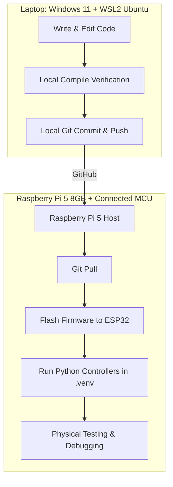

# Project Operational Rules & Deployment Workflow

This document outlines the strict operational division of labor between the **Coding/Development Host** and the **Physical Execution Host (Raspberry Pi 5)**. Adhering to these rules ensures code integrity, simplifies tracking, and prevents direct-edit configuration drift on physical hardware.

---

## 1. Environment Classification



### Development Host (Laptop)
*   **System**: Windows 11 running WSL2 (Ubuntu 22.04).
*   **Purpose**: The primary workstation where the AI agent and developer write, modify, refactor, and locally verify compilation of code.
*   **Constraint**: No physical microcontroller flashing, telemetry monitoring, or calibration scripts are run directly from here. All changes are committed and pushed to the remote repository.

### Execution Host (Raspberry Pi 5)
*   **System**: Raspberry Pi 5 (8GB) connected to physical sensors and actuators (ESP32 via USB-serial).
*   **Purpose**: The runtime platform for flashing, dataset logging, testing, and debugging.
*   **Constraint**: No raw code editing or manual file overrides are done on the Pi. The Pi only consumes clean, version-controlled code pulled from the remote repository.

---

## 2. Step-by-Step Cycle of Operations

Always execute changes in the exact sequence defined below:

### Step 1: Code & Verify (Laptop)
1.  Write code, update drivers, adjust kinematic solvers, or alter packet schemas inside the WSL2 workspace.
2.  Run the local verify/build step to catch compile-time syntax errors and static assertions:
    ```bash
    ~/.local/bin/pio run
    ```

### Step 2: Push to GitHub (Laptop)
1.  Stage, commit, and push changes to the remote repository:
    ```bash
    git add .
    git commit -m "firmware: implement core driver layer and verification"
    git push origin main
    ```

### Step 3: Pull & Deploy (Raspberry Pi 5)
1.  Establish an SSH session to the Raspberry Pi 5.
2.  Navigate to the repository folder and pull the latest changes:
    ```bash
    git pull origin main
    ```
3.  Activate the local Python virtual environment to manage dependencies:
    ```bash
    source .venv/bin/activate
    ```
4.  Flash the firmware binary to the connected ESP32 module using PlatformIO Core on the Pi:
    ```bash
    pio run --target upload
    ```

### Step 4: Test & Debug (Raspberry Pi 5)
1.  Run runtime testing, telemetry checks, or calibration tools inside the activated virtual environment on the Pi.
2.  Observe physical reactions, print outputs, or dataset outputs.
3.  If bugs are discovered, **do not edit code files directly on the Pi**. Note the logs, return to the **Laptop (WSL2)**, and repeat the cycle from Step 1.

---

## 3. Tool & Dependency Rules

*   **Virtual Environments**: All Python dependencies on the Pi must remain isolated inside the local `.venv/` directory. Never install project packages globally (`sudo pip`).
*   **PlatformIO Registry**: Microcontroller library changes must be declared inside `platformio.ini` under `lib_deps` so the Pi can automatically resolve and download toolchains on the next `pio run --target upload`.
